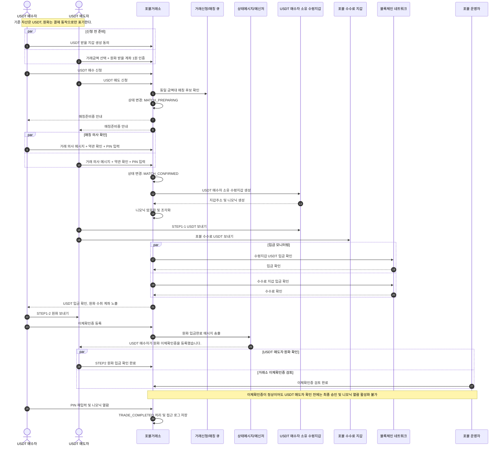

# USDT 안전거래 정책 분석 명세서

- 문서명: USDT 안전거래 정책 분석 및 개발 기준
- 기준 버전: v1.0
- 기준 자산: USDT
- 적용 화면: 시퀀스, STEP 해석, 상태 정의, 버튼 정책, 메시지, 운영/보안/정산/정책문서

---

## 1. 결론

본 문서는 USDT를 유일한 기준 자산으로 고정한다. 원화는 거래자의 역할명이 아니라 결제 동작으로만 표현한다.

- USDT 매수자 = 원화를 보내고 USDT를 받는 사람
- USDT 매도자 = USDT를 보내고 원화를 받는 사람
- 화면, 약관, 메시지, 운영자 화면에서는 `USDT 매수자`, `USDT 매도자` 풀네임을 사용한다.
- 원화 관련 문구는 `원화 보내기`, `원화 받기`, `원화 입금 확인`처럼 동작으로 표기한다.

---

## 2. 페이지 목적

이 페이지는 운영자, 개발자, CS, 준법/보안 담당자가 USDT 안전거래의 진행 순서와 정책 조건을 같은 기준으로 확인하기 위한 개발 뷰다.

주요 목적은 다음과 같다.

1. 최종 거래 흐름을 단일 Mermaid 시퀀스로 확인한다.
2. 고객 화면의 STEP과 내부 상태값을 매핑한다.
3. 버튼 활성화 조건, 메시지, 모니터링 기준을 검토한다.
4. 니모닉, 개인정보, 증빙, 정산, 수수료 정책을 한 화면에서 확인한다.
5. 본문 전체 검색으로 단어와 문구를 빠르게 찾는다.

---

## 3. 거래자 정의

| 구분 | 정의 | 화면 표기 원칙 |
|---|---|---|
| USDT 매수자 | 원화를 보내고 USDT를 받는 사람 | `USDT 매수자`로 표기 |
| USDT 매도자 | USDT를 보내고 원화를 받는 사람 | `USDT 매도자`로 표기 |
| 원화 | USDT 대가를 지급하는 결제 수단 | 역할명이 아니라 보내기/받기/확인 동작으로 표기 |
| USDT | 매칭, 전송, 수령, 니모닉 대상 기준 자산 | 모든 수량과 수수료 산정의 기준 |

내부 코드 매핑은 다음과 같이 고정한다.

| 내부 코드 | 화면/문서 의미 |
|---|---|
| BUYER | USDT 매수자 |
| SELLER | USDT 매도자 |

---

## 4. 상태 구조

### 4.1 외부 노출 상태

| 상태 | 의미 | 취소 가능 여부 |
|---|---|---|
| 거래없음 | 신청 전 또는 취소 완료 후 대기 | 해당 없음 |
| 거래신청 | 신청 접수 후 동일 금액대 상대 대기 | 가능 |
| 매칭준비중 | 상대와 매칭 후보가 되었으나 확정 전 | 양측 PIN 완료 전 가능 |
| 매칭확정 | 약관, PIN, 필요 시 ARS 동의 완료 | 불가 |
| 거래진행중 | USDT 전송, 원화 보내기, 증빙 검토 진행 | 불가 |
| 거래완료 | 니모닉 열람 및 최종 완료 | 불가 |
| 분쟁검토 | 금액 불일치, 미입금, 증빙 불충분 등 검토 | 불가 |
| 취소완료 | 취소 처리 완료 | 해당 없음 |

### 4.2 내부 상태값

| 내부 상태값 | 외부 상태 | 설명 |
|---|---|---|
| NONE | 거래없음 | 신청 전 |
| REQUESTED_BUY | 거래신청 | USDT 매수 신청 등록 |
| REQUESTED_SELL | 거래신청 | USDT 매도 신청 등록 |
| MATCH_PREPARING | 매칭준비중 | 동일 금액대 상대와 매칭 후보 생성 |
| MATCH_MESSAGE_BUYER_SENT | 매칭준비중 | USDT 매수자 매칭 의사 메시지 송신 |
| MATCH_MESSAGE_SELLER_SENT | 매칭준비중 | USDT 매도자 매칭 의사 메시지 송신 |
| MATCH_TERMS_BUYER_SIGNED | 매칭준비중 | USDT 매수자 약관동의 및 PIN 서명 |
| MATCH_TERMS_SELLER_SIGNED | 매칭준비중 | USDT 매도자 약관동의 및 PIN 서명 |
| MATCH_CONFIRMED | 매칭확정 | 양측 약관/PIN 및 필요 시 ARS 동의 완료 |
| BUYER_WALLET_CREATED | 거래진행중 | USDT 매수자 수령지갑 생성 |
| SELLER_ACCOUNT_VERIFIED | 거래진행중 | USDT 매도자 원화 수취 계좌 인증 완료 |
| SELLER_USDT_SENT_PENDING | 거래진행중 | USDT 매도자 USDT 전송 확인 중 |
| SELLER_USDT_CONFIRMED | 거래진행중 | USDT 매수자 수령지갑 및 수수료 지갑 입금 확인 |
| BUYER_KRW_TRANSFER_PROOF_SUBMITTED | 거래진행중 | USDT 매수자 이체확인증 등록 |
| SELLER_KRW_CONFIRMED | 거래진행중 | USDT 매도자 원화 입금 확인 |
| FOBLGATE_TRANSFER_REVIEW_COMPLETED | 거래진행중 | 거래소 이체확인증 검토 완료. USDT 매도자 원화 입금 확인 전에는 최종 승인 불가 |
| BUYER_MNEMONIC_VIEWED | 거래완료 | USDT 매수자 니모닉 열람 |
| TRADE_COMPLETED | 거래완료 | 거래 완료 |
| CANCELED | 취소완료 | 취소 처리 |
| DISPUTE_REVIEW | 분쟁검토 | 분쟁 또는 예외 검토 |

---

## 5. 고객 경험 STEP

| 단계 | 화면 의미 | USDT 매수자 행동 | USDT 매도자 행동 | 완료 조건 |
|---|---|---|---|---|
| 사전준비 | 신청 전 필수 준비 | USDT 받을 지갑 생성 동의 | 거래금액 선택 + 원화 받을 계좌 1원 인증 | 신청 가능 조건 충족 |
| 매칭준비중 | 의사 확인과 PIN 입력 | 거래 의사 메시지, 약관 확인, PIN 입력 | 거래 의사 메시지, 약관 확인, PIN 입력 | 양측 메시지와 PIN 완료 |
| 매칭확정 | 취소 불가 전환과 지갑주소 생성 | 매칭확정 확인 | 매칭확정 확인 | MATCH_CONFIRMED 및 지갑주소 생성 |
| STEP1-1 | USDT 보내기/입금 대기 | USDT 입금 대기 | USDT 보내기 | 수령지갑 및 수수료 지갑 입금 확인 |
| STEP1-2 | 원화 보내기/입금 대기 | 원화 보내기 + 이체확인증 등록 | 원화 입금 대기 | 이체확인증 등록 및 입금완료 메시지 송출 |
| STEP2 | 원화 입금 확인과 USDT 수령 확인 | USDT 수령 확인(니모닉 열람) | 원화 입금 확인 | USDT 매도자 원화 입금 확인 + 거래소 이체확인증 검토 완료 후 니모닉 열람 시 거래완료 |
| 완료 | 거래 종료와 로그 보관 | 완료 내역 확인 | 완료 내역 확인 | 보관 정책 적용 |

신청 가능 조건은 FOBL 회원가입 완료, KYC 완료, 입출금 가능 상태, 매칭서비스 이용 등록 완료를 기준으로 한다. EDD 대상 또는 STR 보고 이력이 있는 회원도 거래소 입출금이 가능한 상태이면 이용 가능하다. KYC 재이행 대상, 블랙리스트, 입출금 제한 회원, 거래제한 회원, 점검 또는 한도 초과 상태, AML/FDS 제한 대상은 신청을 차단한다.

---

## 6. 전체 Mermaid 시퀀스

---

## 7. 버튼 정책

### 7.1 USDT 매수자 버튼

| 버튼명 | 노출 단계 | 활성화 조건 | 클릭 후 동작 |
|---|---|---|---|
| USDT 매수 신청 | 거래없음 | 사전준비 완료, KYC 정상, 제한 없음 | 신청 등록 |
| 신청취소 | 거래신청 | 매칭 전 | 신청 취소 |
| 매칭취소 | 매칭준비중 | 양측 PIN 완료 전 | 매칭 해제 |
| 거래 의사 메시지 보내기 | 매칭준비중 | 매칭 후보 생성 | 의사 메시지 저장 |
| 동의 및 PIN 제출 | 매칭준비중 | 약관 확인 | 서명 저장 |
| USDT 수령지갑 생성하기 | 매칭확정 | 지갑 생성 동의 및 PIN 완료 | 수령지갑 생성 |
| 원화 보내기 완료 | STEP1-2 | USDT 입금 확인 후 | 원화 이체 상태 기록 |
| 이체확인증 등록 | STEP1-2 | 원화 보내기 후 | 증빙 등록 |
| 니모닉 열람 | STEP2 | USDT 매도자 원화 입금 확인 및 거래소 이체확인증 검토 모두 완료 | 니모닉 복호화, 거래완료 |

### 7.2 USDT 매도자 버튼

| 버튼명 | 노출 단계 | 활성화 조건 | 클릭 후 동작 |
|---|---|---|---|
| USDT 매도 신청 | 거래없음 | 원화 수취 계좌 인증 가능, KYC 정상, 제한 없음 | 신청 등록 |
| 신청취소 | 거래신청 | 매칭 전 | 신청 취소 |
| 매칭취소 | 매칭준비중 | 양측 PIN 완료 전 | 매칭 해제 |
| 거래 의사 메시지 보내기 | 매칭준비중 | 매칭 후보 생성 | 의사 메시지 저장 |
| 동의 및 PIN 제출 | 매칭준비중 | 약관 확인 | 서명 저장 |
| 원화 수취 계좌 1원 인증 | 사전준비 | 본인명의 계좌 입력 | 원화 수취 계좌 검증 |
| USDT 보내기 | STEP1-1 | 수령지갑 및 수수료 지갑 주소 노출 | USDT 전송 안내 |
| 원화 입금 확인 완료 | STEP2 | 이체확인증 등록 후 | 원화 수취 확인 저장 |

---

## 8. 메시지 정책

| 이벤트 | USDT 매수자 메시지 | USDT 매도자 메시지 |
|---|---|---|
| 신청 접수 | USDT 매수 신청이 접수되었습니다. | USDT 매도 신청이 접수되었습니다. |
| 매칭준비중 | 상대방과 매칭되었습니다. 약관 확인과 PIN 입력을 완료해주세요. | 상대방과 매칭되었습니다. 약관 확인과 PIN 입력을 완료해주세요. |
| 매칭확정 | 매칭이 확정되었습니다. 이후 임의 취소는 불가합니다. | 매칭이 확정되었습니다. 이후 임의 취소는 불가합니다. |
| 수령지갑 생성 | USDT 수령지갑이 생성되었습니다. | 상대방의 USDT 수령지갑이 생성되었습니다. |
| 계좌번호 전달 | USDT 매도자의 원화 수취 계좌번호가 전달되었습니다. | 원화 수취 계좌가 상대방에게 전달되었습니다. |
| USDT 입금 확인 | USDT 입금이 확인되었습니다. 원화 보내기를 진행해주세요. | USDT 입금이 확인되었습니다. 원화 입금 대기 상태입니다. |
| 이체확인증 등록 | 이체확인증이 등록되었습니다. 거래소 검토와 원화 입금 확인을 기다려주세요. | 상대방이 원화 이체확인증을 등록했습니다. 원화 입금 여부를 확인해주세요. |
| 원화 입금 확인 | USDT 매도자가 원화 입금을 확인했습니다. | 원화 입금 확인이 완료되었습니다. |
| 니모닉 열람 | 니모닉 열람으로 거래완료가 확정되었습니다. | 상대방의 USDT 수령 확인으로 거래가 완료되었습니다. |

메신저 문구는 상대방 지칭이 충분한 경우 `상대방`을 사용하고, 역할이 필요한 경우 `USDT 매수자`, `USDT 매도자` 풀네임을 사용한다.

---

## 9. 모니터링 및 승인 정책

| 대상 | 확인 항목 | 주체 | 처리 기준 |
|---|---|---|---|
| 매칭 | 동일 금액대 신청 존재 여부 | 시스템 | 대기열 유지 또는 매칭 후보 생성 |
| 매칭 진행 시간 | 영업일 10:00~19:00 여부 | 시스템 | 신청은 상시 접수, 매칭 수행은 영업시간 기준 |
| 약관/PIN | 양측 동의와 PIN 서명 | 시스템 | 미완료 시 매칭확정 차단 |
| ARS 동의 | 고객 동의 결과 | 시스템+운영자 | 동의/동의안함/응답없음 기록 |
| USDT 입금 | 수령지갑과 수수료 지갑 입금 | 시스템 | 지연/불일치 알림 |
| 이체확인증 | 첨부, 금액, 예금주, 위조 의심 | 시스템+운영자 | 정상/보완/분쟁 |
| 원화 입금 | USDT 매도자 확인 버튼 | USDT 매도자 | 미확인 알림 |
| 이체확인증 정상·매도자 미확인 | 이체확인증 정상 검토 후 USDT 매도자 확인 버튼 미클릭 | 운영자 | 최종 승인 차단, 확인 요청 알림/유선 확인/지연 로그 |
| 니모닉 열람 | USDT 매도자 확인, 거래소 검토, 열람 기간, PIN 검증, 접근 로그 | 시스템 | 두 조건 모두 완료 시 활성화, 기간 만료 후 차단 |
| 분쟁 | 증빙, 로그, 고객 주장 | 운영자+준법 | 보류/정상처리/반환검토 |

---

## 10. 니모닉 및 보안

| 항목 | 정책 |
|---|---|
| 수령지갑 소유 | USDT 매수자 소유 수령지갑으로 고정 |
| 포블 권한 제한 | 포블은 수령지갑 자산 통제권을 보유하지 않으며 단독 복구, 단독 자산 이동, 단독 자산 반환 불가 |
| 니모닉 저장 | 평문 저장 금지, 암호화 및 조각화 |
| 조각 명칭 | USDT 매수자 PIN 조각, USDT 매도자 PIN 조각, 포블 보안조각 |
| 열람 시점 | STEP2에서 USDT 매도자 원화 입금 확인과 거래소 이체확인증 검토가 모두 완료된 후 |
| 열람 효과 | 최초 열람 시 거래완료 확정 |
| 재열람 및 삭제 | 거래완료(니모닉 최초 열람) 후 7일간 재열람 가능, 7일 경과 후 영구 삭제 및 복구 불가 |
| 접근 로그 | 열람자, 일시, IP, 기기, 거래번호, 결과 저장 |
| 책임 고지 | 열람 후 보관, 공유, 분실 책임은 USDT 매수자에게 안내 |

---

## 11. 정산 및 수수료

USDT 매수자는 원화만 지급하고, 수수료와 프리미엄은 USDT 매도자가 USDT로 부담한다.

| 항목 | 산식/기준 | 용도 |
|---|---|---|
| USDT 매수자 원화 이체액 | 거래금액 | USDT 매도자에게 정확히 이체 |
| 기준 USDT 수량 | 거래금액 / USDT 기준가 | 수수료와 프리미엄 차감 전 수량 |
| USDT 매도자 부담 차감 USDT | USDT 매도자 부담 수수료 + 매도 프리미엄 | 시장 내 매도 우위 설정값 반영 |
| USDT 매수자 실제 수령 USDT | 기준 USDT 수량 - 차감 USDT | 수령지갑 입금 검증 기준 |
| 포블 수수료 USDT | USDT 매도자 수수료 + 부담 수수료 | 수수료 지갑 입금 기준 |
| USDT 매도자 원화 수령액 | 거래금액 | 원화 받기 금액 |

매도 프리미엄은 USDT 거래 시장에서 매도 우위를 확보하기 위해 금액대와 시장 상황별로 적용하는 설정값이다. 이 값은 USDT 매도자가 USDT로 부담하며 USDT 매수자 수령 수량 산정에 반영한다.

---

## 12. 개인정보, 증빙, 보존 정책

| 자료 유형 | 거래완료 후 처리 | 보존기간 |
|---|---|---|
| 상대방 화면 노출 계좌정보 | 즉시 비노출 또는 마스킹 | 노출 종료 |
| 상대방 화면 노출 이체확인 요약 | 거래완료 후 마스킹 | 30일 후 비노출 권장 |
| USDT 매도자 수취계좌 원본 | 암호화 분리보관 | 5년 |
| USDT 매수자 이체확인증 원본 | 암호화 분리보관 | 5년 |
| USDT 매도자 입금확인 버튼 이력 | 보관 | 5년 |
| 약관동의·PIN·ARS 결과 | 보관 | 5년 |
| 거래금액·상태값·거래조건 | 보관 | 5년 |
| 지갑주소·TXID·수수료 입금내역 | 보관 | 5년 |
| 니모닉 열람 로그 | 보관 | 5년 |
| 소비자 불만·분쟁처리 기록 | 보관 | 3년 |

개인정보 수집 이용 제공 동의와 개인정보 처리방침은 별도 Markdown 원문을 기준으로 정책문서 탭에 표시한다.

---

## 13. 약관 및 정책문서

약관, 이용가이드, 동의 팝업의 첫 영역에는 거래자 정의를 고정 노출한다.

필수 반영 문구:

> USDT 매수자는 원화를 보내고 USDT를 받는 사람입니다. USDT 매도자는 USDT를 보내고 원화를 받는 사람입니다.

약관 제4조 성격의 거래 책임 문구는 다음 기준을 따른다.

> USDT 매수자는 USDT 매도자 본인명의 원화 계좌로 거래금액을 이체하고, USDT 매도자는 지정된 USDT 수령지갑과 수수료 지갑으로 USDT를 전송해야 합니다.

동의 팝업은 다음 세 가지를 구분한다.

| 문서 | 단계 | 핵심 내용 |
|---|---|---|
| 매칭확정 전 꼭 확인 | STEP1 | 약관, PIN, ARS 확인 후 매칭확정 |
| USDT 수령지갑 생성 동의 | STEP2 | USDT 매수자 소유 수령지갑 생성, 니모닉 책임 안내 |
| 니모닉 열람 동의 | STEP2 | 열람 시 거래완료 확정, 접근정보 인수 |
| 개인정보 수집 이용 제공 동의 | 동의 | 개인정보 수집·이용·제공 범위 |
| 개인정보 처리방침 | 약관 | 개인정보 처리 기준, 보관, 파기, 권리 행사 |

---

## 14. 예외처리

| 예외 | 처리 기준 |
|---|---|
| USDT 입금 지연 | USDT 매도자에게 재전송 안내, 제한시간 초과 시 운영자 검토 |
| 수수료 미입금 | 다음 단계 차단, 보완 요청 |
| 원화 금액 부족 | 보완 요청 또는 분쟁검토 |
| 예금주 불일치 | 제3자 입금 여부 확인 후 분쟁검토 |
| 이체확인증 위조 의심 | 거래 보류 및 준법 검토 |
| 원화 입금 부인 | 이체확인증, 입금내역, 로그, 녹취 등 종합 검토 |
| USDT 반환 요청 | 원화 미입금 또는 증빙 불충분 시 운영자+준법 검토 |
| 니모닉 열람 후 자산 분실 주장 | 보안 로그와 열람 고지 이력 검토 |

---

## 15. 운영자 화면

| 영역 | 표시 기준 |
|---|---|
| 역할 필터 | USDT 매수자, USDT 매도자, 포블, 운영자 |
| 거래 상세 | 거래번호, 금액, 상태, 양측 회원, 매칭시간, 버튼 이력 |
| USDT 매수자 정보 | KYC, 제한 여부, 수령지갑, 이체확인증 |
| USDT 매도자 정보 | KYC, 제한 여부, 원화 수취 계좌, 입금확인 |
| 증빙 | 이체확인증, TXID, 수수료 입금, 메시지 로그 |
| 분쟁 | 주장, 증빙, 처리 상태, 반환 승인 로그 |

---

## 16. 검색 기능

검색은 본문 전체 텍스트를 대상으로 한다.

- 여러 단어 입력 시 모든 단어가 포함된 섹션과 항목을 찾는다.
- 공백과 특수문자를 정규화해 붙여쓰기 검색도 매칭한다.
- 일치 섹션은 좌측 내비게이션에 표시한다.
- 원문 단어 단위 일치 부분은 하이라이트한다.
- 검색어가 없으면 전체 섹션을 복구한다.

---

## 17. 검증 체크리스트

| 항목 | 기준 |
|---|---|
| 기준 자산 | 모든 흐름이 USDT 기준으로 정의되어 있는가 |
| 역할 표기 | 단독 역할명이 아니라 `USDT 매수자`, `USDT 매도자`로 표시되는가 |
| 원화 표현 | 원화가 역할명이 아니라 보내기/받기/확인 동작으로 표시되는가 |
| STEP 체계 | 사전준비, 매칭준비중, 매칭확정, STEP1-1, STEP1-2, STEP2, 완료로 통일되었는가 |
| Mermaid | 최종 시퀀스만 제공되는가 |
| 버튼 | 버튼명이 자산 흐름 동사 중심인가 |
| 메시지 | USDT와 원화 입금을 혼동하지 않도록 명시되어 있는가 |
| 정산 | 수수료와 매도 프리미엄의 USDT 부담 주체가 명확한가 |
| 개인정보 | 증빙, 계좌, 로그 보존기간이 명시되어 있는가 |
| 검색 | 본문 단어와 문구 검색이 가능한가 |

---

## 18. 최종 평가

현재 기준은 USDT 거래 시장의 통상 표현과 화면 행동을 일치시키는 방향이다. USDT를 기준 자산으로 고정하고 원화를 결제 동작으로 제한해, 고객이 자신의 역할을 혼동하더라도 `보내기`, `받기`, `확인` 버튼만 보고 진행할 수 있게 한다.

최종 고객 흐름은 다음 하나로 통일한다.

`사전준비 -> 매칭준비중 -> 매칭확정 -> STEP1-1 -> STEP1-2 -> STEP2 -> 완료`
