# USDT 안전거래 시퀀스 개발 뷰 해석 페이지 명세서

- 문서명: USDT 안전거래 시퀀스 개발 뷰 해석 페이지 명세서
- 버전: v1.0
- 작성 목적: 개발 산출물, 화면 설계 보조자료, 운영/CS/준법 검토자료
- 대상 서비스: 포블거래소 회원 간 USDT 안전거래 매칭 중계 서비스
- 대상 사용자:
  - 서비스 기획자
  - 프론트엔드 개발자
  - 백엔드 개발자
  - 어드민/운영 담당자
  - 준법/AML/FDS 담당자
  - CS/분쟁처리 담당자

---

## 1. 결론

본 문서는 USDT 안전거래 시퀀스를 단순 Mermaid 다이어그램으로만 관리하지 않고, **고객 경험 순서, 시스템 상태, 버튼 동작, 메신저 문구, 포블 모니터링/승인 포인트, 보안정책, 취소/패널티 정책을 한 화면에서 해석할 수 있는 웹서비스형 개발 뷰**를 정의한다.

해당 페이지는 다음 목적을 가진다.

1. 개발자가 전체 거래 흐름과 상태 전이를 즉시 이해할 수 있도록 한다.
2. 기획자가 고객 화면 메시지, 버튼 활성화 조건, STEP 구성을 검토할 수 있도록 한다.
3. 운영자가 모니터링/승인/예외처리 지점을 확인할 수 있도록 한다.
4. 준법/보안 담당자가 취소 제한, 니모닉 열람, 로그 보관, 분쟁 대응 근거를 검토할 수 있도록 한다.
5. CS 담당자가 고객 문의 발생 시 현재 거래 상태와 다음 행동을 쉽게 설명할 수 있도록 한다.

---

## 2. 페이지 정의

### 2.1 페이지명

**USDT 안전거래 정책 분석**

### 2.2 메뉴 위치 예시

| 구분 | 위치 |
|---|---|
| 어드민 상단 메뉴 | 거래·마켓 또는 신규 서비스 관리 |
| 좌측 1메뉴 | USDT 안전거래 |
| 좌측 2메뉴 | 시퀀스 해석 뷰 |
| 보조 메뉴 | 상태정의 / 버튼정책 / 메시지정책 / 모니터링 / 보안정책 |

### 2.3 페이지 목적

해당 페이지는 실제 거래 데이터를 처리하는 운영 화면이 아니라, **개발 산출물 및 업무 해석용 정적/준정적 문서형 웹페이지**이다.

다만 향후 실제 거래 건과 연동할 경우, 각 거래의 현재 상태를 이 명세 구조에 매핑하여 **거래 진행 타임라인 조회 화면**으로 확장할 수 있다.

---

## 3. 웹서비스 화면 구성

### 3.1 전체 레이아웃

```text
┌──────────────────────────────────────────────────────────────┐
│ 상단: 서비스명 / 버전 / 상태범례 / 다운로드 / Mermaid 보기     │
├───────────────┬──────────────────────────────────────────────┤
│ 좌측 내비게이션 │ 우측 본문                                      │
│               │                                              │
│ 1. 전체 시퀀스 │ [탭1] 고객 경험 순서                            │
│ 2. STEP 해석  │ [탭2] 시스템 상태/메시지                          │
│ 3. 버튼 정책  │ [탭3] 버튼 활성화 조건                            │
│ 4. 모니터링   │ [탭4] 포블 모니터링/승인                           │
│ 5. 취소/패널티│ [탭5] 취소/패널티 정책                             │
│ 6. 보안/로그  │ [탭6] 니모닉/로그/열람 만료 정책                     │
│ 7. 예외처리   │ [탭7] 지연/불일치/분쟁 처리                         │
└───────────────┴──────────────────────────────────────────────┘
```

### 3.2 주요 컴포넌트

| 컴포넌트 | 설명 |
|---|---|
| Mermaid 시퀀스 뷰어 | 전체 거래 시퀀스를 다이어그램으로 표시 |
| STEP 타임라인 | STEP1~STEP5를 카드형으로 표시 |
| 고객 경험 패널 | 매수자/매도자 관점에서 보이는 메시지와 버튼 표시 |
| 시스템 상태 패널 | 내부 상태값, 상태메시지, 상태 전환 조건 표시 |
| 메신저 로그 패널 | 상태 변화에 따라 상대방에게 발송되는 자동 메시지 표시 |
| 포블 모니터링 패널 | 블록체인 입금, 수수료 입금, 원화 이체확인증, 운영자 승인 지점 표시 |
| 취소/패널티 패널 | 취소 가능 단계, 취소자/상대방 상태 복귀, 횟수 제한 표시 |
| 보안정책 패널 | 니모닉 열람 제한, 암호화 조각화, 접근 로그, 열람 만료 정책 표시 |

---

## 4. 전체 거래 상태 구조

### 4.1 외부 노출용 상태

| 상태 | 설명 | 취소 가능 여부 |
|---|---|---|
| 거래없음 | 신청 전 최초 상태 | 해당 없음 |
| 거래신청 | 매수 또는 매도 거래신청 후 상대방 매칭 대기 | 가능 |
| 매칭준비중 | 상대방과 매칭되었으나 확정 전 | 가능 |
| 매칭확정 | 양측 메시지, 약관동의, PIN 서명 완료 | 불가 |
| 거래진행중 | USDT 전송, 원화 이체, 확인증 검토 등 진행 | 불가 |
| 거래완료 | 매수자 지갑 확인 완료 | 불가 |
| 분쟁검토 | 금액 불일치, 미입금, 증빙 불충분 등 운영자 검토 | 불가 |
| 취소완료 | 신청 또는 매칭준비중 취소 완료 | 해당 없음 |

### 4.2 내부 상태값

| 내부 상태값 | 외부 상태 | 설명 |
|---|---|---|
| NONE | 거래없음 | 거래신청 전 |
| REQUESTED_BUY | 거래신청 | 매수 신청 등록 |
| REQUESTED_SELL | 거래신청 | 매도 신청 등록 |
| MATCH_PREPARING | 매칭준비중 | 동일 금액대 상대와 매칭 |
| MATCH_MESSAGE_BUYER_SENT | 매칭준비중 | 매수자 매칭 메시지 송신 |
| MATCH_MESSAGE_SELLER_SENT | 매칭준비중 | 매도자 매칭 메시지 송신 |
| MATCH_TERMS_BUYER_SIGNED | 매칭준비중 | 매수자 약관동의 및 PIN 서명 |
| MATCH_TERMS_SELLER_SIGNED | 매칭준비중 | 매도자 약관동의 및 PIN 서명 |
| MATCH_CONFIRMED | 매칭확정 | 양측 약관/PIN 완료 |
| BUYER_WALLET_CREATED | 거래진행중 | 매수자 USDT 수령 지갑 생성 |
| SELLER_ACCOUNT_VERIFIED | 거래진행중 | 매도자 원화 수취 계좌 1원 인증 완료 |
| SELLER_USDT_SENT_PENDING | 거래진행중 | 매도자 USDT 전송 대기 또는 확인 중 |
| SELLER_USDT_CONFIRMED | 거래진행중 | 매수자 지갑 입금 및 수수료 입금 확인 |
| BUYER_KRW_TRANSFER_PROOF_SUBMITTED | 거래진행중 | 매수자 이체확인증 등록 |
| SELLER_KRW_CONFIRMED | 거래진행중 | 매도자 원화 수취 확인 |
| FOBLGATE_TRANSFER_REVIEW_COMPLETED | 거래진행중 | 포블 이체확인증 검토 완료 |
| BUYER_MNEMONIC_VIEWED | 거래진행중 | 매수자 니모닉 열람 |
| TRADE_COMPLETED | 거래완료 | 매수자 지갑 확인 완료 |
| CANCELED | 취소완료 | 취소 처리 |
| DISPUTE_REVIEW | 분쟁검토 | 분쟁 또는 예외 검토 |

---

## 5. 고객 경험 기준 STEP 구성

### 5.1 STEP 요약

| STEP | 명칭 | 매수자 경험 | 매도자 경험 | 완료 조건 |
|---|---|---|---|---|
| 신청 | 거래신청 | 매수 금액 선택 후 신청 | 매도 금액 선택 후 신청 | 동일 금액대 상대방 매칭 |
| STEP1 | 매칭확정 확인 | 매칭 메시지 송신, 약관동의, PIN 입력, ARS 거래확정 동의 | 매칭 메시지 송신, 약관동의, PIN 입력, ARS 거래확정 동의 | 양측 메시지 + 양측 PIN + ARS 동의 완료 |
| STEP2 | 준비정보 생성 | USDT 수령 지갑 생성 위임 동의 | 원화 수취 계좌 1원 인증 | 지갑 생성 + 계좌 인증 완료 |
| STEP3 | USDT 전송 확인 | 매도자 USDT 입금 확인 대기 | 매수자 지갑과 수수료 지갑으로 USDT 전송 | 두 입금 모두 블록체인 확인 |
| STEP4 | 원화 이체 확인 | 매도자 계좌로 원화 이체, 확인증 등록 | 원화 수취 확인, 이체확인 완료 클릭 | 확인증 검토 + 매도자 확인 |
| STEP5 | 지갑 확인 | PIN 입력 후 니모닉 열람, 지갑 확인 완료 | 매수자 지갑 확인 완료 대기 | 매수자 지갑 확인 완료 |
| 완료 | 거래완료 | 거래 종료 | 거래 종료 | TRADE_COMPLETED |

---

## 6. 전체 Mermaid 시퀀스

```mermaid
sequenceDiagram
    autonumber

    actor Buyer as USDT 매수자
    actor Seller as USDT 매도자
    participant Foblgate as 포블거래소
    participant Queue as 거래신청/매칭 큐
    participant Messenger as 상태메시지/메신저
    participant BuyWallet as 매수자 소유 USDT 지갑
    participant FeeWallet as 포블 수수료 지갑
    participant Chain as 블록체인 네트워크
    participant Ops as 포블 운영자

    Note over Buyer,Seller: 최초 상태: 거래없음

    alt 매수신청으로 시작하는 경우
        Buyer->>Foblgate: [버튼] USDT 매수 거래신청<br/>금액 선택: 500만원 / 1,000만원 / 2,000만원 / 5,000만원
        Foblgate->>Queue: 매수 신청 등록<br/>신청시간 기준 대기열 저장
        Foblgate-->>Buyer: [상태메시지] 매수 거래를 신청하였습니다.
        Foblgate-->>Buyer: [화면] 상태: 거래신청<br/>[버튼] 신청취소 활성화

        Seller->>Foblgate: [버튼] USDT 매도 거래신청 또는 매도 선택<br/>동일 금액대 기준
        Foblgate->>Queue: 동일 금액대 매도 신청 확인
        Queue-->>Foblgate: 먼저 신청한 순서 기준 매칭 후보 반환

    else 매도신청으로 시작하는 경우
        Seller->>Foblgate: [버튼] USDT 매도 거래신청<br/>금액 선택: 500만원 / 1,000만원 / 2,000만원 / 5,000만원
        Foblgate->>Queue: 매도 신청 등록<br/>신청시간 기준 대기열 저장
        Foblgate-->>Seller: [상태메시지] 매도 거래를 신청하였습니다.
        Foblgate-->>Seller: [화면] 상태: 거래신청<br/>[버튼] 신청취소 활성화

        Buyer->>Foblgate: [버튼] USDT 매수 거래신청 또는 매수 선택<br/>동일 금액대 기준
        Foblgate->>Queue: 동일 금액대 매수 신청 확인
        Queue-->>Foblgate: 먼저 신청한 순서 기준 매칭 후보 반환
    end

    opt 거래신청 단계에서 신청자가 취소하는 경우
        Buyer->>Foblgate: [버튼] 신청취소
        Foblgate->>Queue: 신청 건 삭제
        Foblgate-->>Buyer: [상태메시지] 거래신청을 취소하였습니다.
        Foblgate-->>Buyer: [화면] 상태: 거래없음
    end

    Foblgate->>Foblgate: 매칭 후보 확정<br/>상태: 매칭준비중

    Foblgate-->>Buyer: [상태메시지] 상대 거래자와 매칭되었습니다.<br/>매칭 확정을 준비하세요.
    Foblgate-->>Seller: [상태메시지] 상대 거래자와 매칭되었습니다.<br/>매칭 확정을 준비하세요.

    Foblgate-->>Buyer: [화면] STEP1 매칭확정 확인<br/>[버튼] 매칭 메시지 보내기 활성화<br/>[버튼] 매칭취소 활성화
    Foblgate-->>Seller: [화면] STEP1 매칭확정 확인<br/>[버튼] 매칭 메시지 보내기 활성화<br/>[버튼] 매칭취소 활성화

    alt 매수자가 매칭준비중 단계에서 취소하는 경우
        Buyer->>Foblgate: [버튼] 매칭취소
        Foblgate->>Queue: 매칭 해제<br/>매수자 신청 종료
        Foblgate-->>Buyer: [상태메시지] 매칭을 취소하였습니다.
        Foblgate-->>Buyer: [화면] 상태: 거래없음

        Foblgate->>Queue: 매도자 기존 신청 건 재대기 처리
        Foblgate-->>Seller: [상태메시지] 상대방이 매칭을 취소하였습니다.<br/>기존 신청 상태로 돌아갑니다.
        Foblgate-->>Seller: [화면] 상태: 거래신청<br/>[버튼] 신청취소 활성화

    else 매도자가 매칭준비중 단계에서 취소하는 경우
        Seller->>Foblgate: [버튼] 매칭취소
        Foblgate->>Queue: 매칭 해제<br/>매도자 신청 종료
        Foblgate-->>Seller: [상태메시지] 매칭을 취소하였습니다.
        Foblgate-->>Seller: [화면] 상태: 거래없음

        Foblgate->>Queue: 매수자 기존 신청 건 재대기 처리
        Foblgate-->>Buyer: [상태메시지] 상대방이 매칭을 취소하였습니다.<br/>기존 신청 상태로 돌아갑니다.
        Foblgate-->>Buyer: [화면] 상태: 거래신청<br/>[버튼] 신청취소 활성화
    else 양측 모두 취소하지 않고 STEP1 진행
        Note over Buyer,Seller: STEP1 진행
    end

    Buyer->>Foblgate: [버튼] 매칭 메시지 보내기
    Foblgate->>Messenger: 매수자 매칭 의사 메시지 생성
    Messenger-->>Seller: [메신저] USDT 매수 거래를 신청합니다. 매수 거래 약관에 동의해주세요.
    Foblgate-->>Buyer: [상태메시지] 매칭 메시지를 상대방에게 송신하였습니다.
    Foblgate-->>Seller: [상태메시지] 상대방이 매칭 메시지를 보냈습니다.
    Foblgate->>Foblgate: 매수자 의사표시 상태 = 확정

    Seller->>Foblgate: [버튼] 매칭 메시지 보내기
    Foblgate->>Messenger: 매도자 매칭 의사 메시지 생성
    Messenger-->>Buyer: [메신저] USDT 매도 거래를 신청합니다. 매도 거래 약관에 동의해주세요.
    Foblgate-->>Seller: [상태메시지] 매칭 메시지를 상대방에게 송신하였습니다.
    Foblgate-->>Buyer: [상태메시지] 상대방이 매칭 메시지를 보냈습니다.
    Foblgate->>Foblgate: 매도자 의사표시 상태 = 확정

    Foblgate->>Foblgate: 양측 매칭 메시지 송신 완료 확인
    Foblgate-->>Buyer: [화면] [버튼] 동의 및 PIN 제출 활성화
    Foblgate-->>Seller: [화면] [버튼] 동의 및 PIN 제출 활성화

    Buyer->>Foblgate: [버튼] 동의 및 PIN 제출
    Foblgate-->>Buyer: [화면] USDT 매수 거래 약관 노출
    Buyer->>Foblgate: 약관 동의 + PIN 6자리 입력
    Foblgate->>Foblgate: 매수자 PIN 검증 및 확정서명 저장
    Foblgate->>Messenger: 매수자 약관동의 메시지 생성
    Messenger-->>Seller: [메신저] 매수자가 USDT 매수 거래 약관에 동의하였습니다.

    Seller->>Foblgate: [버튼] 동의 및 PIN 제출
    Foblgate-->>Seller: [화면] USDT 매도 거래 약관 노출
    Seller->>Foblgate: 약관 동의 + PIN 6자리 입력
    Foblgate->>Foblgate: 매도자 PIN 검증 및 확정서명 저장
    Foblgate->>Messenger: 매도자 약관동의 메시지 생성
    Messenger-->>Buyer: [메신저] 매도자가 USDT 매도 거래 약관에 동의하였습니다.

    Foblgate->>Foblgate: 양측 약관동의 및 PIN 서명 완료 확인
    Foblgate->>Foblgate: 상태 변경: 매칭확정
    Foblgate-->>Buyer: [상태메시지] 매칭이 확정되었습니다.<br/>매칭 확정 이후에는 임의로 취소할 수 없습니다.
    Foblgate-->>Seller: [상태메시지] 매칭이 확정되었습니다.<br/>매칭 확정 이후에는 임의로 취소할 수 없습니다.

    opt STEP1 매칭확정 확인
        Foblgate->>Ops: ARS 고객 동의 대상 생성
        Ops->>Buyer: ARS 거래확정 동의 요청
        Buyer-->>Ops: 동의/동의안함/응답없음 응답
        Ops->>Seller: ARS 거래확정 동의 요청
        Seller-->>Ops: 동의/동의안함/응답없음 응답
        Ops->>Foblgate: 재확인 결과 등록
    end

    par 매수자 STEP2 - 수령 지갑 생성
        Buyer->>Foblgate: [버튼] STEP2 이동
        Foblgate-->>Buyer: [화면] USDT 지갑 생성 위임 동의
        Buyer->>Foblgate: [버튼] 지갑주소 생성하기<br/>지갑 생성 위임 동의
        Foblgate->>BuyWallet: 매수자 소유 USDT 지갑 생성
        BuyWallet-->>Foblgate: 지갑주소 및 니모닉 생성
        Foblgate->>Foblgate: 니모닉 암호화 처리<br/>매수자 PIN 조각 + 매도자 PIN 조각 + 포블 보안조각
        Foblgate->>Messenger: 매수자 지갑주소 생성 메시지 생성
        Messenger-->>Seller: [메신저] 매수자가 USDT 지갑주소를 생성하였습니다.

    and 매도자 STEP2 - 원화 수취 계좌 준비
        Seller->>Foblgate: [버튼] STEP2 이동
        Foblgate-->>Seller: [화면] 원화 수취 계좌 1원 인증 안내
        Seller->>Foblgate: 1원 인증 수행
        Foblgate->>Foblgate: 매도자 본인명의 계좌 검증
        Foblgate->>Messenger: 매도자 입금계좌 준비 메시지 생성
        Messenger-->>Buyer: [메신저] 매도자가 입금계좌를 준비하였습니다.
    end

    Foblgate->>Foblgate: 매수자 지갑 생성 완료 + 매도자 1원 인증 완료 확인
    Foblgate-->>Seller: [화면] STEP3 이동 버튼 활성화
    Foblgate-->>Buyer: [화면] STEP3 이동 버튼 활성화

    Seller->>Foblgate: [버튼] STEP3 이동
    Foblgate-->>Seller: [화면] 매수자 USDT 지갑주소 노출
    Foblgate-->>Seller: [화면] 포블 USDT 수수료 지갑주소 노출

    Seller->>BuyWallet: USDT 선 전송<br/>매수자 소유 지갑주소
    Seller->>FeeWallet: 수수료 USDT 전송<br/>포블 수수료 지갑주소

    par 매수자 지갑 입금 모니터링
        Foblgate->>Chain: 매수자 소유 지갑 USDT 입금 모니터링
        Chain-->>Foblgate: 매수자 지갑 입금 확인
        Foblgate->>Foblgate: 매수자 지갑 입금 DB 반영

    and 포블 수수료 지갑 입금 모니터링
        Foblgate->>Chain: 포블 수수료 지갑 USDT 입금 모니터링
        Chain-->>Foblgate: 수수료 입금 확인
        Foblgate->>Foblgate: 수수료 입금 DB 반영
    end

    alt 제한시간 내 USDT 및 수수료 입금 모두 정상 확인
        Foblgate->>Foblgate: 매도자 USDT 전송 완료 처리
        Foblgate->>Messenger: 매도자 USDT 전송 완료 메시지 생성
        Messenger-->>Buyer: [메신저] 매도자가 USDT 전송을 완료하였습니다.
        Foblgate-->>Buyer: [상태메시지] USDT 정상 입금이 확인되었습니다.
        Foblgate-->>Seller: [상태메시지] USDT 정상 입금이 확인되었습니다.
    else 제한시간 내 입금 미확인 또는 수량 불일치
        Foblgate->>Ops: USDT 입금 지연/수량불일치 알림 생성
        Ops->>Seller: 유선 또는 알림으로 재진행 안내
        Foblgate-->>Seller: [상태메시지] USDT 입금 확인이 지연되고 있습니다.<br/>거래소 확인 후 안내됩니다.
        Foblgate-->>Buyer: [상태메시지] 상대방의 USDT 입금 확인이 지연되고 있습니다.<br/>거래소 확인 후 안내됩니다.
    end

    Buyer->>Foblgate: [버튼] STEP4 이동
    Foblgate-->>Buyer: [화면] 매도자 원화 수취 계좌번호 노출
    Foblgate-->>Buyer: [상태메시지] 매도자의 계좌번호가 전달되었습니다.

    Buyer->>Seller: 원화 이체<br/>본인명의 계좌에서 이체
    Buyer->>Foblgate: [버튼] 이체확인증 등록
    Foblgate-->>Buyer: [화면] 이체확인증 활용 동의<br/>본인명의 계좌 이체 확인 및 분쟁 증빙 활용
    Buyer->>Foblgate: 이체확인증 첨부 + 동의 제출

    Foblgate->>Messenger: 매수자 원화 이체 메시지 생성
    Messenger-->>Seller: [메신저] 매수자가 매도자의 계좌로 거래금액을 이체하였습니다.

    opt 이체확인증 등록 후 필요 시
        Ops->>Seller: 유선으로 원화 수취 여부 확인
        Seller-->>Ops: 원화 수취 여부 유선 응답
        Ops->>Foblgate: 유선 확인 결과 등록
    end

    Seller->>Foblgate: [버튼] STEP4 이동
    Foblgate-->>Seller: [화면] 매수자 이체확인증 확인<br/>입금 금액 이상유무 확인
    Seller->>Foblgate: [버튼] 이체확인 완료
    Foblgate->>Foblgate: 매도자 이체확인 완료 저장

    Foblgate->>Messenger: 매도자 이체확인 완료 메시지 생성
    Messenger-->>Buyer: [메신저] 매도자가 매수자의 계좌이체를 확인하였습니다.

    Ops->>Foblgate: 이체확인증 검토 완료 등록
    Foblgate->>Foblgate: 이체확인증 등록 여부 + 매도자 이체확인 + 포블 검토 완료 확인

    alt 이체확인 정상 완료
        Foblgate-->>Buyer: [상태메시지] 이체 확인이 정상적으로 완료되었습니다.
        Foblgate-->>Buyer: [화면] STEP5 이동 버튼 활성화
        Foblgate-->>Seller: [화면] STEP5 이동 버튼 활성화
    else 이체확인 불일치 또는 분쟁 발생
        Foblgate->>Ops: 분쟁/검토 티켓 생성
        Foblgate-->>Buyer: [상태메시지] 이체 확인에 추가 검토가 필요합니다.<br/>거래소 안내를 기다려주세요.
        Foblgate-->>Seller: [상태메시지] 이체 확인에 추가 검토가 필요합니다.<br/>거래소 안내를 기다려주세요.
    end

    Buyer->>Foblgate: [버튼] STEP5 이동
    Foblgate-->>Buyer: [화면] 지갑 니모닉 열람 안내<br/>이체확인 검토 완료 후 최초 열람 가능<br/>최초 열람 시점부터 7일간만 열람 가능
    Buyer->>Foblgate: [버튼] 니모닉 열람<br/>PIN 입력
    Foblgate->>Foblgate: PIN 기반 니모닉 열람 권한 검증
    Foblgate->>Foblgate: 2-of-3 복호화 조건 충족 확인
    Foblgate-->>Buyer: 니모닉 열람 제공<br/>본인 지갑 소유 확인 및 책임 고지
    Foblgate->>Foblgate: 열람 시 거래완료 확정

    Buyer->>Foblgate: [버튼] 지갑 확인 완료
    Foblgate->>Messenger: 매수자 지갑 확인 완료 메시지 생성
    Messenger-->>Seller: [메신저] 매수자가 지갑을 정상적으로 확인하였습니다.

    Foblgate->>Foblgate: 거래완료 처리
    Foblgate-->>Buyer: [상태메시지] 거래가 종료되었습니다.
    Foblgate-->>Seller: [상태메시지] 거래가 종료되었습니다.
```



---

## 7. 고객 경험 순서 상세

### 7.1 매수자 경험 순서

| 순서 | 화면/단계 | 매수자 행동 | 화면 메시지 | 다음 조건 |
|---:|---|---|---|---|
| 1 | 거래신청 | 금액 선택 후 매수 신청 | 매수 거래를 신청하였습니다. | 동일 금액대 매도자 매칭 |
| 2 | 매칭준비중 | 매칭 결과 확인 | 상대 거래자와 매칭되었습니다. 매칭 확정을 준비하세요. | 매칭 메시지 송신 |
| 3 | STEP1 | 매칭 메시지 보내기 | 매칭 메시지를 상대방에게 송신하였습니다. | 상대방 메시지 수신 |
| 4 | STEP1 | 약관동의 및 PIN 제출 | 나의 거래약관 동의가 완료되었습니다. | 상대방 PIN 완료 |
| 5 | 매칭확정 | 취소 불가 상태 진입 | 매칭이 확정되었습니다. 매칭 확정 이후에는 임의로 취소할 수 없습니다. | STEP2 이동 |
| 6 | STEP2 | 지갑 생성 위임 동의 | USDT 수령 지갑주소를 생성하였습니다. | 매도자 계좌 준비 |
| 7 | STEP3 | USDT 입금 확인 대기 | USDT 정상 입금이 확인되었습니다. | STEP4 이동 |
| 8 | STEP4 | 매도자 계좌 확인 후 원화 이체 | 매도자의 계좌번호가 전달되었습니다. | 이체확인증 등록 |
| 9 | STEP4 | 이체확인증 등록 | 이체확인증이 등록되었습니다. 포블 검토 및 매도자 확인을 기다려주세요. | 매도자 확인 + 포블 검토 |
| 10 | STEP5 | 이체확인 검토 완료 후 PIN 입력 및 니모닉 열람 | 니모닉 열람 시 거래 완료가 확정됩니다. | 최초 열람 시점부터 7일간만 열람 가능 |
| 11 | 완료 | 지갑 확인 완료 클릭 | 거래가 종료되었습니다. | 거래 종료 |

### 7.2 매도자 경험 순서

| 순서 | 화면/단계 | 매도자 행동 | 화면 메시지 | 다음 조건 |
|---:|---|---|---|---|
| 1 | 거래신청 | 금액 선택 후 매도 신청 | 매도 거래를 신청하였습니다. | 동일 금액대 매수자 매칭 |
| 2 | 매칭준비중 | 매칭 결과 확인 | 상대 거래자와 매칭되었습니다. 매칭 확정을 준비하세요. | 매칭 메시지 송신 |
| 3 | STEP1 | 매칭 메시지 보내기 | 매칭 메시지를 상대방에게 송신하였습니다. | 상대방 메시지 수신 |
| 4 | STEP1 | 약관동의 및 PIN 제출 | 나의 거래약관 동의가 완료되었습니다. | 상대방 PIN 완료 |
| 5 | 매칭확정 | 취소 불가 상태 진입 | 매칭이 확정되었습니다. 매칭 확정 이후에는 임의로 취소할 수 없습니다. | STEP2 이동 |
| 6 | STEP2 | 원화 수취 계좌 1원 인증 | 원화 수취 계좌 등록이 완료되었습니다. | 매수자 지갑 생성 |
| 7 | STEP3 | 매수자 지갑 및 수수료 지갑으로 USDT 전송 | USDT 전송을 진행하세요. | 블록체인 입금 확인 |
| 8 | STEP3 | 입금 반영 대기 | USDT 정상 입금이 확인되었습니다. | STEP4 이동 |
| 9 | STEP4 | 매수자 이체확인증 확인 | 매수자가 이체확인증을 등록하였습니다. 원화 수취 여부를 확인하세요. | 원화 수취 확인 |
| 10 | STEP4 | 이체확인 완료 버튼 클릭 | 매수자의 이체금액을 정상적으로 확인하였습니다. | 포블 검토 완료 |
| 11 | STEP5 | 매수자 지갑 확인 완료 대기 | 매수자가 지갑을 정상적으로 확인하였습니다. | 거래 종료 |
| 12 | 완료 | 거래 종료 확인 | 거래가 종료되었습니다. | 거래 종료 |

---

## 8. 버튼 정책

### 8.1 매수자 버튼

| 버튼명 | 노출 단계 | 활성화 조건 | 클릭 시 동작 | 비활성화 조건 |
|---|---|---|---|---|
| 매수 거래신청 | 거래없음 | 로그인, KYC 완료, 거래제한 없음 | 매수 신청 등록 | 제한 회원, 점검, 한도 초과 |
| 신청취소 | 거래신청 | 거래신청 상태 | 신청 삭제, 거래없음 복귀 | 매칭준비중 이후 일부 조건 |
| 매칭취소 | 매칭준비중 | 양측 PIN 완료 전 | 본인 거래없음, 상대방 거래신청 복귀 | 매칭확정 이후 |
| 매칭 메시지 보내기 | STEP1 | 매칭준비중 진입 | 상대방에게 매수 의사 메시지 발송 | 이미 발송 |
| 동의 및 PIN 제출 | STEP1 | 양측 매칭 메시지 송신 완료 | 약관동의 및 PIN 서명 저장 | 상대방 메시지 미송신 |
| STEP2 이동 | 매칭확정 | 양측 PIN 완료 | 지갑생성 화면 이동 | 매칭 미확정 |
| 지갑주소 생성하기 | STEP2 | 지갑 생성 위임 동의 | 매수자 소유 USDT 지갑 생성 | 이미 생성 |
| STEP4 이동 | STEP3 완료 후 | USDT 및 수수료 입금 확인 완료 | 매도자 계좌 확인 화면 이동 | 입금 미확인 |
| 이체확인증 등록 | STEP4 | 매도자 계좌 노출 후 | 확인증 첨부 및 동의 저장 | 파일 누락, 동의 미체크 |
| STEP5 이동 | 이체확인 완료 후 | 매도자 확인 + 포블 검토 완료 | 니모닉 열람 화면 이동 | 검토 미완료 |
| 니모닉 열람 | STEP5 | 이체확인 검토 완료 후 PIN 재입력, 최초 열람 시점부터 7일 내 | 니모닉 복호화 및 열람 제공, 거래완료 확정 | 기간 만료, PIN 실패 |
| 지갑 확인 완료 | STEP5 | 니모닉 열람 이후 | 본인 지갑 소유 확인 기록 | 니모닉 미열람 |

### 8.2 매도자 버튼

| 버튼명 | 노출 단계 | 활성화 조건 | 클릭 시 동작 | 비활성화 조건 |
|---|---|---|---|---|
| 매도 거래신청 | 거래없음 | 로그인, KYC 완료, 거래제한 없음 | 매도 신청 등록 | 제한 회원, 점검, 한도 초과 |
| 신청취소 | 거래신청 | 거래신청 상태 | 신청 삭제, 거래없음 복귀 | 매칭준비중 이후 일부 조건 |
| 매칭취소 | 매칭준비중 | 양측 PIN 완료 전 | 본인 거래없음, 상대방 거래신청 복귀 | 매칭확정 이후 |
| 매칭 메시지 보내기 | STEP1 | 매칭준비중 진입 | 상대방에게 매도 의사 메시지 발송 | 이미 발송 |
| 동의 및 PIN 제출 | STEP1 | 양측 매칭 메시지 송신 완료 | 약관동의 및 PIN 서명 저장 | 상대방 메시지 미송신 |
| STEP2 이동 | 매칭확정 | 양측 PIN 완료 | 1원 인증 화면 이동 | 매칭 미확정 |
| 1원 인증 | STEP2 | 본인명의 계좌 입력 | 원화 수취 계좌 검증 | 계좌 불일치, 인증 실패 |
| STEP3 이동 | STEP2 완료 후 | 매수자 지갑 생성 + 매도자 계좌 인증 완료 | 지갑주소 2개 노출 | 지갑 미생성 또는 계좌 미인증 |
| 입금 완료 확인 대기 | STEP3 | USDT 전송 후 | 블록체인 모니터링 대기 | 수량 불일치 |
| STEP4 이동 | STEP3 완료 후 | USDT 및 수수료 입금 확인 완료 | 원화 수취 확인 화면 이동 | 입금 미확인 |
| 이체확인 완료 | STEP4 | 매수자 이체확인증 등록 후 | 원화 수취 확인 저장 | 확인증 미등록 또는 금액 불일치 |
| STEP5 이동 | STEP4 완료 후 | 포블 검토 완료 | 최종 대기 화면 이동 | 검토 미완료 |

---

## 9. 시스템 메시지 정책

### 9.1 상태메시지

상태메시지는 사용자의 현재 화면에 표시되는 안내 문구이다.  
메신저와 달리 상대방에게 반드시 대화형으로 전달되는 것은 아니며, 현재 상태를 설명하는 용도로 사용한다.

| 이벤트 | 매수자 상태메시지 | 매도자 상태메시지 |
|---|---|---|
| 매수 신청 | 매수 거래를 신청하였습니다. | - |
| 매도 신청 | - | 매도 거래를 신청하였습니다. |
| 매칭 성립 | 상대 거래자와 매칭되었습니다. 매칭 확정을 준비하세요. | 상대 거래자와 매칭되었습니다. 매칭 확정을 준비하세요. |
| 매수자 매칭 메시지 송신 | 매칭 메시지를 상대방에게 송신하였습니다. | 상대방이 매칭 메시지를 보냈습니다. |
| 매도자 매칭 메시지 송신 | 상대방이 매칭 메시지를 보냈습니다. | 매칭 메시지를 상대방에게 송신하였습니다. |
| 매수자 약관동의 | 나의 거래약관 동의가 완료되었습니다. | 상대방의 거래약관 동의가 완료되었습니다. |
| 매도자 약관동의 | 상대방의 거래약관 동의가 완료되었습니다. | 나의 거래약관 동의가 완료되었습니다. |
| 매칭확정 | 매칭이 확정되었습니다. 매칭 확정 이후에는 임의로 취소할 수 없습니다. | 매칭이 확정되었습니다. 매칭 확정 이후에는 임의로 취소할 수 없습니다. |
| 매수자 지갑 생성 | USDT 수령 지갑주소를 생성하였습니다. | 상대방의 USDT 지갑주소 생성이 완료되었습니다. |
| 매도자 계좌 준비 | 상대방의 입금계좌 준비가 완료되었습니다. | 원화 수취 계좌 등록이 완료되었습니다. |
| USDT 입금 확인 | USDT 정상 입금이 확인되었습니다. | USDT 정상 입금이 확인되었습니다. |
| USDT 입금 지연 | 상대방의 USDT 입금 확인이 지연되고 있습니다. 거래소 확인 후 안내됩니다. | USDT 입금 확인이 지연되고 있습니다. 거래소 확인 후 안내됩니다. |
| 계좌번호 전달 | 매도자의 계좌번호가 전달되었습니다. | - |
| 이체확인증 등록 | 이체확인증이 등록되었습니다. 포블 검토 및 매도자 확인을 기다려주세요. | 매수자가 이체확인증을 등록하였습니다. 원화 수취 여부를 확인하세요. |
| 매도자 이체확인 | 매도자가 이체금액을 확인하였습니다. | 매수자의 이체금액을 정상적으로 확인하였습니다. |
| 포블 검토 완료 | 이체 확인이 정상적으로 완료되었습니다. | 이체 확인이 정상적으로 완료되었습니다. |
| 분쟁검토 | 이체 확인에 추가 검토가 필요합니다. 거래소 안내를 기다려주세요. | 이체 확인에 추가 검토가 필요합니다. 거래소 안내를 기다려주세요. |
| 니모닉 열람 | 지갑 니모닉이 열람되었습니다. | - |
| 지갑 확인 완료 | 지갑을 정상적으로 확인하였습니다. | 매수자가 지갑을 정상적으로 확인하였습니다. |
| 거래 종료 | 거래가 종료되었습니다. | 거래가 종료되었습니다. |

### 9.2 메신저 문구

메신저는 상태 변화에 따라 상대방에게 자동 발송되는 거래 진행 메시지이다.

| 발생 조건 | 수신자 | 메신저 문구 |
|---|---|---|
| 매수자 매칭 메시지 송신 | 매도자 | USDT 매수 거래를 신청합니다. 매수 거래 약관에 동의해주세요. |
| 매도자 매칭 메시지 송신 | 매수자 | USDT 매도 거래를 신청합니다. 매도 거래 약관에 동의해주세요. |
| 매수자 약관동의/PIN 완료 | 매도자 | 매수자가 USDT 매수 거래 약관에 동의하였습니다. 매도자 약관 동의와 PIN 제출을 완료해주세요. |
| 매도자 약관동의/PIN 완료 | 매수자 | 매도자가 USDT 매도 거래 약관에 동의하였습니다. 매수자 약관 동의와 PIN 제출을 완료해주세요. |
| 매도자 1원 인증 완료 | 매수자 | 매도자가 입금계좌를 준비하였습니다. 매수자 USDT 지갑주소 생성을 완료해주세요. |
| 매수자 지갑 생성 완료 | 매도자 | 매수자가 USDT 지갑주소를 생성하였습니다. 해당 지갑과 포블 수수료 지갑으로 USDT를 전송해주세요. |
| 매도자 USDT + 수수료 입금 완료 | 매수자 | 매도자가 USDT 전송을 완료하였습니다. 매도자 계좌로 원화를 이체하고 확인증을 등록해주세요. |
| 매수자 이체확인증 등록 | 매도자 | 매수자가 매도자의 계좌로 거래금액을 이체하였습니다. 원화 수취 여부를 확인해주세요. |
| 매도자 이체확인 완료 | 매수자 | 매도자가 매수자의 계좌이체를 확인하였습니다. 포블 검토 완료 후 니모닉을 열람해주세요. |
| 매수자 지갑 확인 완료 | 매도자 | 매수자가 지갑을 정상적으로 확인하였습니다. 거래 종료 내역을 확인해주세요. |

---

## 10. 포블 모니터링 및 승인 정책

### 10.1 모니터링 대상

| 구분 | 모니터링 항목 | 자동/수동 | 실패 시 처리 |
|---|---|---|---|
| 매칭 | 동일 금액대 신청 존재 여부 | 자동 | 대기열 유지 |
| 취소 | 취소 횟수 및 제한 대상 여부 | 자동 | 제한 메시지 노출 |
| 약관/PIN | 양측 약관동의 및 PIN 서명 여부 | 자동 | STEP2 비활성화 |
| STEP1. 매칭확정 확인 | ARS 고객 동의 여부 | 자동+수동 | 동의/동의안함/응답없음 기록 |
| 지갑생성 | 지갑주소/니모닉 생성 성공 여부 | 자동 | 운영자 알림 |
| 계좌인증 | 매도자 본인명의 1원 인증 결과 | 자동 | 재시도 또는 운영자 검토 |
| USDT 입금 | 매수자 지갑 입금 여부 | 자동 | 지연 알림/운영자 확인 |
| 수수료 입금 | 포블 수수료 지갑 입금 여부 | 자동 | 다음 STEP 차단 |
| 이체확인증 | 첨부 여부, 파일 형식, 금액 OCR/수기 검토 | 자동+수동 | 분쟁검토 |
| 원화 수취 | 매도자 확인 버튼 | 수동 | 미확인 알림 |
| 니모닉 열람 | 열람 가능기간, PIN 검증, 접근 로그 | 자동 | 7일 만료 후 열람 차단 |

### 10.2 승인/검토 포인트

| 승인/검토명 | 담당 | 트리거 | 결과값 |
|---|---|---|---|
| STEP1. 매칭확정 확인 | 시스템+운영자 | 매칭확정 전 | ARS 동의/동의안함/응답없음 |
| USDT 입금 지연 확인 | 운영자 | 제한시간(30분) 이내 미입금 | 재진행/분쟁/취소검토 |
| 수수료 입금 미확인 | 운영자 | 수수료 지갑 미입금 | 재전송요청/보류 |
| 이체확인증 검토 | 운영자 | 매수자 확인증 등록 | 정상/보완요청/분쟁 |
| 분쟁 검토 | 운영자+준법 필요 시 | 금액 불일치, 확인 불가 | 정상처리/거래중단/법적대응 검토 |
| USDT 반환 요청 검토 | 운영자+준법 필요 시 | 원화 입금 문제로 매도자 반환 요청 | 반환 가능/불가/추가증빙 |

---

## 11. 취소 제한 및 패널티 정책

### 11.1 취소 가능 단계

| 단계 | 취소 가능 여부 | 설명 |
|---|---|---|
| 거래신청 | 가능 | 아직 상대방과 매칭 전 |
| 매칭준비중 | 가능 | 양측 PIN 서명 전 |
| 매칭확정 | 불가 | 양측 약관동의 및 PIN 서명 완료 |
| 거래진행중 | 불가 | 자산/원화 이동 가능성이 있으므로 임의 취소 금지 |
| 거래완료 | 불가 | 완료 거래 |

### 11.2 취소자/상대방 상태 처리

| 취소 발생 단계 | 취소자 상태 | 상대방 상태 | 설명 |
|---|---|---|---|
| 거래신청 | 거래없음 | 해당 없음 | 단독 신청 취소 |
| 매칭준비중 | 거래없음 | 거래신청 | 상대방은 취소당한 것이므로 기존 신청 상태로 복귀 |
| 매칭확정 이후 | 취소 불가 | 취소 불가 | 운영자 분쟁/보류 처리만 가능 |

### 11.3 취소 횟수 제한

| 기준 | 정책 |
|---|---|
| 일일 취소 허용 횟수 | 2회 |
| 적용 대상 | 거래신청 취소 + 매칭준비중 취소 합산 |
| 1회 취소 | 정상 허용, 경고 없음 |
| 2회 취소 | 허용하되 경고 메시지 노출 |
| 3회 취소 시도 | 당일 신규 거래신청 제한 |
| 제한 해제 | 다음 날 00:00 자동 해제 |
| 운영자 해제 | 가능하되 사유 입력 필수 |
| 악성 반복 판단 | 최근 7일 내 5회 이상 취소 시 운영자 검토 대상 |

### 11.4 재신청 제한

| 조건 | 제한 |
|---|---|
| 일일 3회 취소 도달 | 당일 재신청 제한 |
| 매칭준비중 취소 2회 이상 | 30분간 동일 금액대 재신청 제한 |
| 상대방 신고 또는 반복 노쇼 의심 | 운영자 검토 전까지 거래 제한 |
| 최근 7일 5회 이상 취소 | 24시간 거래신청 제한 또는 운영자 승인 필요 |

### 11.5 사용자 안내 문구

| 상황 | 안내 문구 |
|---|---|
| 2회 취소 후 경고 | 오늘 거래 취소가 2회 발생했습니다. 추가 취소 시 오늘 신규 거래신청이 제한될 수 있습니다. |
| 3회 취소 제한 | 오늘 취소 허용 횟수를 초과하여 신규 거래신청이 제한되었습니다. 제한은 익일 00:00에 해제됩니다. |
| 30분 동일 금액 제한 | 매칭준비중 취소가 반복되어 동일 금액대 재신청이 30분간 제한됩니다. |
| 운영자 검토 대상 | 반복 취소 이력으로 인해 거래신청이 일시 제한되었습니다. 고객센터 또는 운영자 검토 후 해제될 수 있습니다. |

---

## 12. 니모닉 열람 및 보안정책

### 12.1 기본 원칙

매수자 소유 USDT 지갑의 니모닉은 거래 완료 후 매수자에게 제공되며, 포블은 니모닉을 평문으로 저장하지 않는다.  
니모닉은 암호화 및 조각화된 형태로 보관하고, 열람 가능 기간과 접근 로그를 엄격하게 관리한다.

### 12.2 열람 제한

| 항목 | 정책 |
|---|---|
| 최초 열람 가능 시점 | STEP5 진입 후, 이체확인 검토 완료 시 |
| 열람 가능 기간 | 최초 열람 시점부터 7일 |
| 열람 방식 | PIN 재입력 후 열람 |
| 열람 횟수 | 7일 내 최대 3회 권장 |
| 열람 시 거래 상태 | 니모닉 열람 시 거래완료 확정 |
| 책임소재 | 열람 시 매수자가 본인 지갑 소유를 확인한 것으로 간주하며, 이후 니모닉 보관/공유/분실 책임은 매수자에게 있음 |
| 열람 만료 | 7일 경과 후 일반 열람 차단 |
| 만료 후 재열람 | 7일 만료 후 일반/운영자 열람 모두 불가 |

### 12.3 암호화 조각화 구조

| 조각 | 설명 | 보관 위치/주체 |
|---|---|---|
| 매수자 PIN 조각 | 매수자 PIN 기반 파생키 또는 암호화 조각 | 암호화 저장 |
| 매도자 PIN 조각 | 매도자 PIN 기반 파생키 또는 확정서명 조각 | 암호화 저장 |
| 포블 보안조각 | 포블 내부 보안 키 또는 HSM/KMS 기반 조각 | 별도 보안영역 |
| 복호화 조건 | 2-of-3 구조 | 단독 조각 복호화 불가 |

### 12.4 2-of-3 복호화 정책

| 조건 | 허용 여부 |
|---|---|
| 매수자 PIN 조각 단독 | 불가 |
| 포블 보안조각 단독 | 불가 |
| 매도자 PIN 조각 단독 | 불가 |
| 매수자 PIN 조각 + 포블 보안조각 | 가능 |
| 매수자 PIN 조각 + 매도자 PIN 조각 | 원칙적 비권장, 정책상 제한 가능 |
| 매도자 PIN 조각 + 포블 보안조각 | 불가 또는 운영상 금지 권장 |

> 권장 설계: 실제 열람 시에는 **매수자 PIN 조각 + 포블 보안조각** 조합만 허용하고, 매도자 조각은 거래 확정성 및 분쟁 증적 보조 용도로만 활용한다.

### 12.5 접근 로그 정책

| 로그 항목 | 저장 내용 |
|---|---|
| 열람 요청 일시 | yyyy-mm-dd hh:mm:ss |
| 회원번호 | 매수자 회원번호 |
| 거래번호 | 안전거래 거래 ID |
| 요청 IP | 접속 IP |
| 디바이스 정보 | User-Agent, OS, App Version |
| 인증수단 | PIN, 추가 본인확인 여부 |
| 열람 결과 | 성공/실패/차단/만료 |
| 실패 사유 | PIN 오류, 기간 만료, 권한 없음 등 |
| 운영자 개입 여부 | 운영자 승인/거절/사유 |
| 전문 해시 | 열람 요청 전문 및 응답 전문 해시 |
| 보관기간 | 최소 5년 이상 권장 |

### 12.6 열람 만료 정책

| 상황 | 정책 |
|---|---|
| 7일 이내 열람 | PIN 재입력 후 허용, 최대 3회 권장 |
| 7일 경과 후 열람 | 일반 사용자 화면에서 차단 |
| 만료 후 요청 | 니모닉 재열람 제공 불가 |
| 운영자 처리 | 열람 제공이 아니라 접근 로그, 거래 상태, 분쟁 여부 확인 |
| 분쟁 중 문의 | 니모닉 제공 없이 거래 증빙과 보안 로그 기반으로 검토 |
| 만료 로그 | 최초 열람과 동일 수준으로 접근 시도와 차단 사유 저장 |

### 12.7 사용자 안내 문구

| 상황 | 안내 문구 |
|---|---|
| 최초 열람 안내 | 지갑 니모닉은 최초 열람 시점부터 7일간만 열람할 수 있습니다. 열람 시 거래 완료가 확정되며, 반드시 안전한 곳에 직접 보관하세요. |
| 열람 전 경고 | 니모닉을 타인에게 공유하면 자산을 잃을 수 있습니다. 포블은 니모닉 공유로 인한 손실을 복구할 수 없습니다. |
| 책임 고지 | 니모닉 열람은 매수자가 본인 지갑 소유를 확인한 것으로 기록되며, 열람 이후 보관/공유/분실 책임은 매수자에게 있습니다. |
| 열람 만료 | 니모닉 열람 가능 기간이 만료되었습니다. 7일 경과 후에는 재열람이 불가합니다. |
| 만료 후 문의 | 니모닉은 다시 제공할 수 없습니다. 필요한 경우 고객센터에서 접근 로그와 거래 상태를 확인합니다. |

---

## 13. 포블 운영자 화면 연계 항목

### 13.1 운영자 대시보드 카드

| 카드 | 표시 항목 |
|---|---|
| 매칭 대기 | 금액대별 신청 수, 평균 대기시간 |
| 매칭준비중 | PIN 미완료 건, 메시지 미송신 건 |
| USDT 입금 대기 | 제한시간(30분) 초과 건, 수량 불일치 건 |
| 수수료 미입금 | 수수료 입금 미확인 건 |
| 원화 확인 대기 | 이체확인증 등록 후 매도자 미확인 건 |
| 포블 검토 대기 | 운영자 이체확인증 검토 미완료 건 |
| 분쟁검토 | 분쟁 상태 건수 |
| 니모닉 만료 문의 | 열람 만료 후 문의 건수 |

### 13.2 거래 상세 화면 필수 항목

| 영역 | 표시 데이터 |
|---|---|
| 거래 기본정보 | 거래번호, 금액, 거래유형, 매칭시간, 상태 |
| 매수자 정보 | 회원번호, KYC 상태, 제한 여부, 연락처 마스킹 |
| 매도자 정보 | 회원번호, KYC 상태, 제한 여부, 연락처 마스킹 |
| 지갑 정보 | 매수자 지갑주소, 수수료 지갑주소, TXID |
| 계좌 정보 | 매도자 수취 계좌, 1원 인증 결과 |
| 이체확인증 | 파일, 등록시간, 금액, 예금주, 검토상태 |
| 상태 타임라인 | 상태 변경 이력 |
| 메신저 이력 | 자동 발송 메시지 이력 |
| 운영자 조치 | 승인/보류/분쟁/메모 |
| 로그 | PIN 서명, 니모닉 열람, IP, 디바이스 |

---

## 14. 예외처리 정책

### 14.1 USDT 입금 지연

| 조건 | 처리 |
|---|---|
| 제한시간(30분) 이내 미입금 | 매도자에게 재전송 안내 |
| 매수자 지갑만 입금 | 수수료 입금 전까지 다음 단계 차단 |
| 수수료만 입금 | 매수자 지갑 입금 전까지 다음 단계 차단 |
| 수량 부족 | 운영자 확인 후 추가 입금 요청 |
| 과입금 | 운영자 검토 및 반환/정산 정책 적용 |
| 잘못된 네트워크 입금 | 복구 가능 여부 검토, 수수료 부과 가능 |

### 14.2 원화 이체 불일치

| 조건 | 처리 |
|---|---|
| 금액 부족 | 보완 요청 또는 분쟁검토 |
| 금액 초과 | 초과분 반환 안내 |
| 예금주 불일치 | 분쟁검토, 제3자 입금 여부 확인 |
| 이체확인증 위조 의심 | 거래 보류, 운영자/준법 검토 |
| 매도자 미확인 | 알림 재발송, 유선 확인 |
| 매도자 부인 | 이체확인증, 계좌 입금내역, 유선 녹취 등 종합 검토 |

### 14.3 분쟁 상태 전환 조건

| 조건 | 분쟁 전환 여부 |
|---|---|
| USDT 입금 후 원화 미이체 | 분쟁검토 |
| 원화 이체 후 매도자 부인 | 분쟁검토 |
| 확인증 위조 의심 | 분쟁검토 |
| 제3자 명의 입금 | 분쟁검토 |
| 반복 취소 및 노쇼 | 운영자 검토 |
| 니모닉 열람 후 자산 분실 주장 | 보안 로그 검토 |

### 14.4 USDT 반환 요청

| 조건 | 처리 |
|---|---|
| 원화 입금 미확인 | 매도자 반환 요청 접수 후 증빙 확인 |
| 이체확인증 위조 또는 불충분 | 분쟁검토 및 반환 가능 여부 검토 |
| 매수자 원화 미이체 확인 | USDT 반환 절차 검토 |
| 분쟁 중 반환 요청 | 운영자+준법 검토 전 임의 반환 금지 |
| 반환 승인 | TXID, 요청자, 승인자, 사유 로그 저장 |

---

## 15. 데이터 모델 초안

### 15.1 trade_order

| 컬럼 | 설명 |
|---|---|
| order_id | 신청 ID |
| member_id | 신청 회원번호 |
| side | BUY/SELL |
| amount_krw | 거래 금액 |
| status | 신청 상태 |
| cancel_count_daily | 당일 취소 횟수 |
| created_at | 신청일시 |
| canceled_at | 취소일시 |

### 15.2 safe_trade

| 컬럼 | 설명 |
|---|---|
| trade_id | 거래 ID |
| buyer_member_id | 매수자 회원번호 |
| seller_member_id | 매도자 회원번호 |
| amount_krw | 거래금액 |
| usdt_amount | USDT 수량 |
| fee_usdt_amount | 수수료 USDT 수량 |
| status | 현재 거래 상태 |
| matched_at | 매칭일시 |
| confirmed_at | 매칭확정일시 |
| completed_at | 거래완료일시 |
| dispute_at | 분쟁전환일시 |

### 15.3 trade_status_history

| 컬럼 | 설명 |
|---|---|
| history_id | 이력 ID |
| trade_id | 거래 ID |
| from_status | 이전 상태 |
| to_status | 변경 상태 |
| actor_type | BUYER/SELLER/SYSTEM/OPS |
| actor_id | 행위자 ID |
| message | 상태 변경 설명 |
| created_at | 변경일시 |

### 15.4 trade_message_log

| 컬럼 | 설명 |
|---|---|
| message_id | 메시지 ID |
| trade_id | 거래 ID |
| sender_type | SYSTEM/BUYER/SELLER |
| receiver_member_id | 수신 회원번호 |
| message_type | MATCH/TERMS/WALLET/TRANSFER/COMPLETE |
| content | 메시지 내용 |
| sent_at | 발송일시 |
| read_at | 읽은 일시 |

### 15.5 mnemonic_access_log

| 컬럼 | 설명 |
|---|---|
| access_id | 접근 ID |
| trade_id | 거래 ID |
| member_id | 매수자 회원번호 |
| request_ip | 요청 IP |
| device_info | 디바이스 정보 |
| auth_result | 인증 결과 |
| access_result | 열람 결과 |
| failure_reason | 실패 사유 |
| operator_id | 운영자 승인자 |
| created_at | 요청일시 |

---

## 16. 프론트엔드 구현 요구사항

### 16.1 필수 기능

| 기능 | 요구사항 |
|---|---|
| Mermaid 렌더링 | 시퀀스 다이어그램 표시 |
| STEP 카드 | STEP1~STEP5 진행 조건 표시 |
| 역할 필터 | 매수자/매도자/포블/운영자 관점 필터링 |
| 상태 필터 | 거래신청/매칭준비중/매칭확정/거래진행중/거래완료 필터링 |
| 메시지 검색 | 상태메시지/메신저 문구 검색 |
| 버튼 정책표 | 버튼명, 활성화 조건, 클릭 동작 표시 |
| 예외처리표 | 지연/불일치/분쟁 조건 표시 |
| MD 내보내기 | 현재 명세를 Markdown으로 다운로드 |
| JSON 내보내기 | 상태/버튼/메시지 정책을 JSON으로 다운로드 |

### 16.2 추천 UI

| 영역 | 구현 방식 |
|---|---|
| 전체 시퀀스 | 상단 고정 Mermaid Viewer |
| 고객경험 | 좌우 2컬럼, 매수자/매도자 비교 |
| 시스템 메시지 | 테이블 + 검색 |
| 버튼 정책 | Accordion 또는 DataGrid |
| 모니터링 | Kanban 형태 |
| 보안정책 | 정책 카드 + 경고 배지 |
| 예외처리 | 조건/조치 Matrix |

### 16.3 어드민 운영/설정 명세

안전거래 시퀀스는 단순 고객 화면만으로 운영될 수 없으므로, 어드민에서 다음 설정과 운영 관리 기능을 제공해야 한다.

#### 16.3.1 거래 기본 설정

| 설정 항목 | 설정값/정책 | 관리 주체 | 운영 기준 |
|---|---|---|---|
| 거래 금액대 | 500만원 / 1,000만원 / 2,000만원 / 5,000만원 | 운영자 | 금액대별 매칭 큐 기준 |
| 거래 신청 가능 시간 | 상시 또는 운영시간 제한 | 운영자 | 점검/리스크 상황 시 중지 가능 |
| USDT 입금 제한시간 | 30분 | 운영자 | STEP3 지연 판단 기준 |
| STEP별 제한시간 | STEP1/2/4 별도 설정 | 운영자 | 미진행 알림과 보류 기준 |
| ARS 고객 동의 | 사용 | 운영자 | STEP1. 매칭확정 확인 조건 |

#### 16.3.2 수수료/프리미엄 설정

| 설정 항목 | 설정값/정책 | 관리 주체 | 운영 기준 |
|---|---|---|---|
| 매수자 원화 추가 수수료 | 없음 | 정산 담당자 | 매수자는 거래금액만 매도자에게 원화 이체 |
| 매도자 수수료율 | 정률/정액 선택 | 정산 담당자 | 매도자가 포블에 지급하는 본인 수수료 |
| 매도자 부담 수수료율 | 정률/정액 선택 | 정산 담당자 | 매수자 몫 수수료를 매도자가 USDT로 대신 부담 |
| 매도 프리미엄율 | 금액대/시장상황별 설정 | 정산 담당자 | 매도자가 USDT로 부담하며 매수자 수령 USDT에서 차감 |
| 포블 수수료 | USDT 수수료 수량 또는 원화 환산 | 정산 담당자 | 매도자가 포블 수수료 지갑으로 별도 전송 |
| 포블 수수료 지갑 | 네트워크별 지갑주소 | 보안 승인자 | 주소 변경 시 이중 승인 권장 |

#### 16.3.3 게시판/콘텐츠 설정

| 설정 항목 | 설정값/정책 | 관리 주체 | 운영 기준 |
|---|---|---|---|
| 공지사항 | 서비스 공지/점검/정책 변경 | 운영자 | 거래 화면과 게시판 노출 |
| 약관/유의사항 | 매수/매도 약관 분리 | 기획+준법 | STEP1 동의 문구 원천 |
| FAQ | 입금 지연/반환/분쟁/니모닉 | CS | 고객센터 응대 기준 |
| 메시지 템플릿 | 상태메시지/메신저/ARS 문구 | 기획+운영 | 변경 이력 필수 |
| 첨부파일 정책 | 허용 확장자/용량/보관기간 | 운영+보안 | 이체확인증 관리 기준 |

#### 16.3.4 정산/수수료 관리

| 항목 | 산식/기준 | 용도 |
|---|---|---|
| 매수자 원화 이체액 | 거래금액 | 매수자는 매도자에게 선택 금액만 정확히 이체 |
| 기준 USDT 수량 | 거래금액 / USDT 기준가 | 수수료/프리미엄 차감 전 기준 수량 |
| 매도자 부담 차감 USDT | 매도자 부담 수수료 USDT + 매도 프리미엄 USDT | 매도자가 매수자 몫으로 대신 부담하며 매수자 수령 USDT에서 차감 |
| 매수자 실제 수령 USDT | 기준 USDT 수량 - 매도자 부담 차감 USDT | 매수자 지갑 입금 검증 기준 |
| 포블 수수료 USDT | 매도자 수수료 USDT + 매도자 부담 수수료 USDT | 매도자가 포블 수수료 지갑으로 별도 전송 |
| 매도자 원화 수령액 | 거래금액 | 매도자는 매수자로부터 원화 거래금액 수취 |
| 반환 산정 | 고객 무귀책: 입금 USDT 전액 반환 / 고객 귀책: 입금 USDT - 네트워크 비용 등 실비 | 귀책 여부와 반환 승인 결과에 따라 적용 |

| 정산 상태 | 의미 | 관리 주체 |
|---|---|---|
| 정산예정 | 거래 매칭 후 예상 수수료 산정 | 정산 담당자 |
| 정산확정 | 거래완료 및 니모닉 열람 완료 | 시스템 |
| 정산보류 | USDT/원화/확인증 불일치 | 운영자 |
| 분쟁정산 | 분쟁검토 상태 전환 | 운영자+준법 |
| 반환정산 | USDT 반환 요청 승인 또는 반려 | 운영자+정산 |

#### 16.3.5 운영 관리 기능

| 관리 항목 | 운영자가 확인/처리할 내용 |
|---|---|
| 거래 상세 관리 | 거래번호, 금액, 상태, 매수자/매도자, 매칭시간, 상태 타임라인, 버튼 클릭 이력 |
| 이체확인증 검토 | 첨부파일 원본, 금액, 예금주, 계좌, 시간, 정상/보완요청/분쟁검토 처리 |
| 첨부파일 관리 | 허용 확장자, 용량, 다운로드/열람 권한, 보관기간, 삭제 정책 |
| 분쟁 관리 | 분쟁 사유, 매수자/매도자 주장, 증빙, 보류/정상처리/반환검토/법적대응 상태 |
| USDT 반환 요청 | 매도자 반환 요청, 원화 미입금, 확인증 위조, 수량 불일치, 반환 승인 전 임의 송금 차단 |
| ARS 결과 관리 | 동의/동의안함/응답없음, 녹취 또는 전문 로그, 미동의 시 매칭확정 차단 |
| 취소 제한 해제 | 일일 취소 제한, 동일 금액대 30분 제한, 해제 사유와 감사 로그 |
| 니모닉 만료 문의 | 재열람 제공 불가 안내, 접근 로그와 거래 상태 확인, 보안 로그 검토 |
| 게시판/CS 운영 | 공지사항, FAQ, 약관, 안내 템플릿, 분쟁/반환/입금 지연 문의 유형 |

#### 16.3.6 권한/감사 로그

| 권한 | 대상 | 허용 역할 | 감사 기준 |
|---|---|---|---|
| 설정 변경 | 거래 금액대, 제한시간, 수수료 정책 | 운영 관리자 | 승인 로그 필수 |
| 정산 변경 | 수수료, 프리미엄, 기준가, 반환정산 | 정산 담당자 | 이중 승인 권장 |
| 첨부파일 열람 | 이체확인증, 분쟁 증빙 | 운영/준법 | 열람 로그 필수 |
| 분쟁 처리 | 보류, 정상처리, 반환검토 | 운영+준법 | 사유와 증빙 필수 |
| 보안 로그 열람 | 니모닉 접근 로그, IP, 디바이스 | 보안/준법 | 목적 기록 필수 |

### 16.4 정책문서 탭

어드민과 고객 화면에서 참조할 정책문서는 탭 단위로 관리한다. 정책문서는 성격에 따라 두 가지 화면 형태로 분리한다. 매칭확정 동의, 수령지갑 생성 동의, 니모닉 열람 동의, 이용약관 동의는 고객 프론트의 팝업/동의 화면으로 제공한다. 서비스 이용약관, 운영 기준, 이용자 가이드, Q&A, 책임/보안 고지는 고객센터 또는 게시판 글 형태로 제공한다.

팝업/동의 화면은 화면 제목, 핵심 안내, 작은 주제별 점 목록, 빨간색 주의사항, 고객 확인 체크 문구, 버튼 문구를 포함한다. 게시판 글은 제목, 게시글 요약, 서술식 본문, 문의/주의 안내를 포함한다. 글밥이 많은 정책문서 본문은 13px 기준으로 구성해 한 화면에서 스캔 가능하도록 한다.

#### 16.4.1 매칭확정 동의

| 항목 | 내용 |
|---|---|
| 목적 | 양측 거래 의사, 약관/PIN, ARS 동의를 통해 매칭확정을 승인하는 문서 |
| 취소 제한 | 매칭확정 이후에는 이용자가 임의로 거래를 취소할 수 없다. |
| PIN 중요성 | PIN 비밀번호는 매도자의 분쟁처리와 매수자의 니모닉 열람에 반드시 필요한 정보이다. |
| 책임 고지 | PIN 분실, 공유, 관리 부주의로 인해 발생한 자산 손실은 본인 책임이며 포블은 이를 복구할 수 없다. |
| ARS 동의 | ARS 동의 결과가 동의가 아니거나 응답없음인 경우 매칭확정은 차단되거나 운영자 검토로 전환된다. |
| 취소 정책 | 매칭확정 전까지는 매칭취소가 가능하나, 취소 횟수와 재신청 제한 정책이 적용될 수 있다. |

#### 16.4.2 수령지갑 생성 동의

| 항목 | 내용 |
|---|---|
| 목적 | 매수자 소유 USDT 수령 지갑 생성 위임과 소유권/확인 책임을 명확히 하는 문서 |
| 지갑 소유 | 생성되는 USDT 수령 지갑은 매수자 소유 지갑이며 포블 소유 지갑이 아니다. |
| 포블 역할 | 포블은 거래 완료 전까지 안전거래 진행을 위해 지갑 생성과 니모닉 암호화 보관을 대행한다. |
| 매수자 책임 | 매수자는 거래 완료 후 니모닉을 열람하고 본인 지갑으로 복구 또는 이전해 자산 소유를 직접 확인해야 한다. |
| 서명 의미 | 수령지갑 생성 동의는 거래 확정성과 분쟁 대응을 위한 책임 서명으로 저장된다. |
| 보관 로그 | 지갑 생성은 거래당 1회만 허용되며, 생성된 지갑주소와 관련 로그는 감사 목적으로 보관된다. |

#### 16.4.3 니모닉 열람 동의

| 항목 | 내용 |
|---|---|
| 목적 | 니모닉 열람 시 거래완료 확정, 열람 기간, 보관 책임을 고지하는 문서 |
| 열람 조건 | 니모닉 열람은 이체확인 검토 완료 후 STEP5에서만 가능하다. |
| 거래 완료 | 매수자가 니모닉을 열람하면 거래 완료가 확정되며, 매수자가 본인 지갑 소유를 확인한 것으로 기록된다. |
| 열람 기간 | 니모닉은 최초 열람 시점부터 7일간만 재열람할 수 있으며, 7일 경과 후 재열람은 불가하다. |
| 만료 처리 | 7일 경과 후 니모닉 재열람을 위한 복호화/표시 정보는 삭제 또는 차단 처리된다. |
| 감사 보관 | 거래번호, 지갑주소, TXID, 접근 로그는 분쟁/감사 목적의 보관정책에 따라 보관된다. |
| 보관 권장 | 니모닉은 반드시 수기로 보관하거나 메타마스크 등 본인 외부 지갑에 복구/이전해 자산 소유를 확인해야 한다. |

#### 16.4.4 서비스 이용약관

서비스 이용약관과 별개로 매칭확정 전 고객이 확인하는 `이용약관 동의` 팝업을 둔다. 해당 팝업은 포블이 회원 간 USDT 안전거래 매칭을 중계한다는 점, 원화 이체와 USDT 전송은 회원 간 직접 이루어진다는 점, 원화 입금 여부는 이체확인증과 운영자 검토로 확인한다는 점, 매수자 수령지갑은 매수자 소유라는 점, 고객 귀책 없는 반환은 반환 수수료 없이 전액 반환을 원칙으로 한다는 점을 고지한다. 서비스 이용약관 게시글은 12개 조항 내외로 구성하며 목적, 서비스 성격, 포블 역할, 회원 책임, 매칭확정/취소 제한, 원화 이체, USDT 반환, 수령지갑/니모닉, 수수료, 분쟁/증빙 보관, 책임 제한을 포함한다.

이용자 가이드 게시글은 단계별 가이드로 작성하고, 실제 고객센터 게시글 편집 시 화면 캡처가 들어갈 위치를 점선 박스로 표시한다. 캡처 영역은 거래신청, 매칭확정 동의, 지갑 생성, USDT 입금, 원화 이체/이체확인증, 분쟁 전환, 니모닉 열람, 반환/문의 화면을 기준으로 한다.

운영 기준 게시글은 핵심고지, 서비스 제공 범위, 원화 이체대금 처리, 수수료 정책, 가상자산 이전 및 접근정보 제공, 거래확정 및 보류, USDT 반환 기준, 금지 행위를 포함한다. 이 문서는 고객 안내와 내부 처리 기준을 연결하는 문서로 사용한다.

| 조항 | 내용 |
|---|---|
| 제1조 목적 | 포블 USDT 안전거래 중개 서비스의 이용 조건, 거래 절차, 책임 범위, 분쟁 처리 기준을 정한다. |
| 제2조 용어의 정의 | 안전거래, 니모닉, PIN, 수령지갑, 매칭확정, 분쟁검토, 반환정산의 의미는 화면 및 운영 정책 기준을 따른다. |
| 제3조 서비스의 범위 | 포블은 회원 간 USDT 안전거래의 매칭, 상태관리, 메시지, 모니터링, 증빙 검토를 지원한다. 포블은 원화 수취 주체가 아니다. |
| 제4조 회원의 거래 책임 | 매수자는 매도자 본인명의 계좌로 거래금액을 정확히 이체하고, 매도자는 지정 지갑으로 USDT를 정확히 전송해야 한다. |
| 제5조 매칭확정 및 취소 제한 | 매칭확정 이후에는 임의 취소가 제한되며, 보류/분쟁/반환 사유는 운영자 검토로 처리한다. |
| 제6조 PIN, 약관, ARS 동의 | PIN, 약관 동의, ARS 고객 동의는 매칭확정 확인 조건이며 PIN 분실 책임은 회원에게 있다. |
| 제7조 수령지갑 생성 | 수령지갑은 매수자 소유 지갑이며 포블 소유 지갑이 아니다. 포블은 거래 완료 전까지 지갑 생성과 니모닉 암호화 보관을 대행한다. |
| 제8조 원화 이체 및 확인증 | 매수자는 거래금액만 매도자에게 원화로 이체하며 별도 원화 수수료를 부담하지 않는다. |
| 제9조 USDT 입금 및 수수료 | 매도자는 매수자 실제 수령 USDT와 포블 수수료 USDT를 각각 지정 지갑으로 전송한다. |
| 제10조 니모닉 열람과 거래완료 | 니모닉 열람은 이체확인 검토 완료 후 가능하며, 열람 시 거래완료가 확정된다. |
| 제11조 재열람 기간 | 니모닉은 최초 열람 시점부터 7일간만 재열람 가능하며 이후 재열람은 불가하다. |
| 제12조 분쟁, 보류, 반환 | 확인증 위조, 원화 미입금, USDT 수량 불일치 등은 분쟁검토로 전환하며 고객 무귀책 반환은 수수료 없이 전액 반환을 원칙으로 한다. |
| 제13조 수수료와 프리미엄 | 수수료율, 프리미엄율, USDT 기준가, 제한시간, 취소 제한은 어드민 정책 설정에 따른다. |
| 제14조 책임 제한 | 니모닉, PIN, 외부 지갑 관리 부주의로 발생한 자산 손실은 회원 본인 책임이다. |
| 제15조 보안 의무 | 회원은 니모닉과 PIN을 제3자에게 공유해서는 안 되며 안전한 방식으로 보관해야 한다. |
| 제16조 로그와 증빙 보관 | ARS 결과, 약관 동의, PIN 제출 결과, 이체확인증, TXID, 접근 로그는 분쟁/감사 목적으로 보관될 수 있다. |
| 제17조 운영자 검토 | 운영자는 보류, 분쟁, 반환, 정산 변경, 취소 제한 해제에 대해 사유와 증빙을 확인한다. |
| 제18조 서비스 제한 | 점검, 보안위험, 반복 취소, 비정상 거래 탐지, AML/FDS 이슈가 있는 경우 서비스 이용이 제한될 수 있다. |
| 제19조 약관 변경 | 약관과 정책 문구는 운영/준법 승인 후 변경하며 변경 전후 값, 승인자, 적용시각을 저장한다. |
| 제20조 기타 | 본 약관에 명시되지 않은 사항은 관련 법령, 포블 운영정책, 개별 화면 고지, 분쟁처리 기준을 따른다. |

#### 16.4.5 이용자 가이드

| 순서 | 안내 |
|---|---|
| 1 | 거래금액을 선택해 매수 또는 매도 신청을 등록한다. |
| 2 | 상대방과 매칭되면 STEP1에서 매칭 메시지, 약관/PIN, ARS 동의를 완료한다. |
| 3 | 매수자는 STEP2에서 수령지갑 생성에 동의하고, 매도자는 원화 수취 계좌 1원 인증을 완료한다. |
| 4 | 매도자는 STEP3에서 매수자 실제 수령 USDT와 포블 수수료 USDT를 각각 전송한다. |
| 5 | 매수자는 STEP4에서 매도자 계좌로 원화를 이체하고 이체확인증을 등록한다. |
| 6 | STEP5에서 매수자는 니모닉을 열람하고 외부 지갑 복구/이전으로 자산 소유를 확인한다. |

#### 16.4.6 Q&A

| 질문 | 답변 |
|---|---|
| 매칭확정 후 취소할 수 있나요? | 임의 취소는 불가하며 분쟁/보류 사유가 있으면 운영자 검토로 전환됩니다. |
| PIN을 잃어버리면 어떻게 되나요? | 분쟁처리와 니모닉 열람에 필요하므로 반드시 보관해야 하며, 분실 책임은 본인에게 있습니다. |
| 매수자는 수수료를 원화로 더 내나요? | 매수자는 거래금액만 이체하며, 수수료/프리미엄은 매도자가 USDT 수량에서 부담합니다. |
| 니모닉은 언제까지 볼 수 있나요? | 최초 열람 시점부터 7일간만 재열람 가능하며, 이후 재열람은 불가합니다. |
| 원화 입금에 문제가 있으면 어떻게 되나요? | 이체확인증, 계좌내역, 유선확인 등 증빙 검토 후 분쟁 또는 USDT 반환 요청 검토로 처리됩니다. |

#### 16.4.7 책임/보안 고지

| 항목 | 내용 |
|---|---|
| 니모닉 보안 | 니모닉은 타인에게 공유하면 자산을 잃을 수 있는 중요정보이며, 공유/분실에 따른 손실은 복구할 수 없다. |
| PIN 보안 | PIN은 본인 인증과 서명, 분쟁 처리, 니모닉 열람에 필요한 핵심 정보이므로 분실하지 않아야 한다. |
| 로그 보관 | 이체확인증, 계좌정보, 접근 로그, ARS 결과, TXID는 분쟁/감사 목적으로 보관될 수 있다. |
| 첨부파일 보안 | 첨부파일은 허용 확장자와 용량 정책을 따르며, 운영/준법 권한자만 열람할 수 있다. |
| 감사 로그 | 운영자 설정 변경, 정산 변경, 분쟁 처리, 첨부파일 열람은 모두 감사 로그를 남긴다. |

---

## 17. 백엔드 구현 요구사항

### 17.1 상태 전이 검증

백엔드는 프론트엔드 버튼 상태와 별개로 반드시 서버에서 상태 전이 가능 여부를 검증해야 한다.

예시:

```text
MATCH_PREPARING -> MATCH_CONFIRMED
허용 조건:
1. buyer_match_message_sent = true
2. seller_match_message_sent = true
3. buyer_terms_signed = true
4. seller_terms_signed = true
5. buyer_pin_verified = true
6. seller_pin_verified = true
```

### 17.2 중복 클릭 방지

| 대상 | 정책 |
|---|---|
| 거래신청 | idempotency key 적용 |
| 매칭 메시지 보내기 | 1회만 허용 |
| PIN 제출 | 중복 제출 방지 |
| 지갑 생성 | 거래당 1회만 허용 |
| 이체확인증 등록 | 재등록 시 버전 관리 |
| 이체확인 완료 | 매도자 1회 확정, 이후 운영자 정정만 가능 |
| 니모닉 열람 | 접근 로그 기반 횟수 제한 |

---

## 18. 검증 체크리스트

### 18.1 기획 검증

| 항목 | 검증 결과 |
|---|---|
| 고객이 다음 행동을 명확히 알 수 있는가 | 확인 필요 |
| 매수자/매도자의 역할이 명확히 분리되어 있는가 | 충족 |
| 취소 가능/불가 시점이 명확한가 | 충족 |
| 메신저와 상태메시지가 혼동되지 않는가 | 확인 필요 |
| STEP 이동 조건이 화면에서 명확히 보이는가 | 충족 필요 |

### 18.2 개발 검증

| 항목 | 검증 결과 |
|---|---|
| 모든 버튼에 활성화 조건이 있는가 | 충족 |
| 상태 전이 조건이 서버에서 검증되는가 | 필수 |
| 중복 클릭/중복 제출 방지가 있는가 | 필수 |
| 블록체인 모니터링 실패 시 분기가 있는가 | 충족 |
| 운영자 검토 상태가 별도 존재하는가 | 충족 |

### 18.3 운영/준법 검증

| 항목 | 검증 결과 |
|---|---|
| 거래확정 확인 기준이 있는가 | ARS 고객 동의 |
| 취소 패널티 기준이 있는가 | 일 2회 허용, 3회 제한 |
| 이체확인증 검토 기준이 있는가 | 추가 상세화 필요 |
| 분쟁 전환 조건이 있는가 | 충족 |
| 니모닉 열람 로그가 남는가 | 필수 |
| 재열람 정책이 있는가 | 충족 |

---

## 19. 개선안

### 19.1 1차 개발 범위

1차 개발에서는 다음 범위까지만 구현하는 것을 권장한다.

| 우선순위 | 항목 |
|---|---|
| P0 | 전체 Mermaid 시퀀스 뷰어 |
| P0 | STEP별 고객 경험 표 |
| P0 | 상태메시지/메신저 문구 표 |
| P0 | 버튼 활성화 조건 표 |
| P1 | 포블 모니터링/승인 포인트 |
| P1 | 취소/패널티 정책 |
| P1 | 니모닉/로그/열람 만료 정책 |
| P2 | JSON 다운로드 |
| P2 | 실제 거래 데이터 연동 |

### 19.2 향후 확장

| 확장 항목 | 설명 |
|---|---|
| 실제 거래 타임라인 연동 | 특정 거래 ID 입력 시 현재 상태와 이력 표시 |
| 운영자 승인 워크플로우 | 거래확정 확인, 분쟁, USDT 반환 요청 검토 연동 |
| CS 응대 스크립트 자동 생성 | 현재 상태별 고객 안내 문구 자동 표시 |
| FDS 연동 | 반복 취소, 제3자 입금, 거래확정 미동의, 지연거래 탐지 |
| 감사 로그 리포트 | 거래별 상태전이, 버튼 클릭, 승인 이력 출력 |

---

## 20. 최종 평가

### 20.1 완성도

본 명세는 개발자가 화면 구조, 상태값, 버튼 동작, 메시지, 모니터링, 예외처리를 이해할 수 있는 수준으로 구성되어 있다.  
단순 기획 문서가 아니라 실제 개발 산출물로 활용 가능한 구조이다.

### 20.2 논리적 일관성

거래 흐름은 다음 원칙을 따른다.

1. 신청 전/후 구분
2. 매칭준비중과 매칭확정 구분
3. 자산 이동 전 취소 가능
4. 자산 이동 후 운영자 검토만 가능
5. 매수자와 매도자의 STEP 역할 분리
6. 포블의 자동 모니터링과 수동 승인 지점 분리

### 20.3 실무 적용 가능성

실무 적용을 위해 추가로 필요한 항목은 다음과 같다.

| 추가 필요 항목 | 설명 |
|---|---|
| 실제 약관 전문 | 매수/매도 각각 분리 필요 |
| 수수료 산식 | 금액대별 수수료 산정 방식 확정 필요 |
| USDT 수량 산정 기준 | 기준가, 환율, 호가 기준 정의 필요 |
| 입금 제한시간 | 30분 기준. 금액대/네트워크별 예외 정책 결정 필요 |
| 이체확인증 검토 기준 | OCR, 수기검토, 오픈뱅킹 연동 여부 결정 필요 |
| 분쟁 처리 SLA | 운영자 응답 및 처리기한 정의 필요 |

### 20.4 리스크 및 한계

| 리스크 | 설명 | 대응 |
|---|---|---|
| 니모닉 관리 책임 | 거래소가 니모닉 생성/제공에 관여 | 암호화 조각화, 로그, 열람 제한, 약관 고지 |
| 원화 직접 수취 미관여 한계 | 포블이 원화를 직접 수취하지 않음 | 증빙, 오픈뱅킹 확인, 분쟁정책 명확화 |
| 취소 악용 | 매칭 후 반복 취소 가능 | 일 2회 허용, 3회 제한, 7일 5회 운영검토 |
| 수수료 미입금 | USDT 본입금만 완료되는 케이스 | 두 입금 모두 확인 후 다음 단계 허용 |
| 제3자 입금 | AML/KYC 리스크 | 본인명의 계좌 이체 동의 및 검증 |
| 분쟁 장기화 | 매수/매도자 간 주장 불일치 | 운영자 티켓, 증빙보관, 로그기반 판단 |

---

## 21. 결론

USDT 안전거래 정책 분석은 개발팀이 단순 흐름도를 넘어서 **상태 기반 거래 시스템을 정확히 구현하기 위한 기준 문서**로 활용되어야 한다.

특히 다음 4가지는 필수 구현 대상으로 본다.

1. 상태값과 화면문구 분리
2. 버튼 활성화 조건의 서버 검증
3. 취소 횟수 제한 및 재신청 제한
4. 니모닉 7일 열람 제한, 암호화 조각화, 접근 로그, 만료 후 재열람 불가 정책

본 명세를 기준으로 다음 산출물로 확장 가능하다.

1. 화면설계서
2. API 명세서
3. DB 테이블 정의서
4. 어드민 운영화면 명세서
5. CS/분쟁처리 운영 매뉴얼
6. 보안/준법 검토 체크리스트
